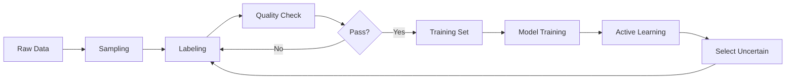

## Introduction

Data labeling is critical for supervised learning. This guide covers deploying Argilla for human annotation and generating synthetic datasets with LLMs.

## Why Data Labeling Matters

<CardGroup cols={2}>
  <Card title="Quality" icon="medal">
    High-quality labels directly improve model performance
  </Card>
  
  <Card title="Consistency" icon="check-double">
    Clear guidelines ensure inter-annotator agreement
  </Card>
  
  <Card title="Efficiency" icon="gauge-high">
    Proper tools accelerate the labeling process
  </Card>
  
  <Card title="Cost" icon="dollar-sign">
    Plan labeling budget based on dataset size and complexity
  </Card>
</CardGroup>

## Argilla

Argilla is an open-source platform for data labeling and feedback collection.

### Key Features

- **Modern UI**: Intuitive interface for annotators
- **Flexible**: Text, token, ranking, and custom tasks
- **Python SDK**: Programmatic dataset creation
- **Collaboration**: Multi-user support with workspaces
- **Feedback**: Collect model predictions for RLHF
- **Integration**: Works with HuggingFace, OpenAI

### Quick Start with Docker

```bash
docker run -it --rm --name argilla -p 6900:6900 \
  argilla/argilla-quickstart:v2.0.0rc1
```

**Access**:
- URL: http://localhost:6900
- User: `argilla`
- Password: `12345678`

<Note>
Default credentials are in the [Dockerfile](https://github.com/argilla-io/argilla/blob/v2.0.0rc1/argilla-server/docker/quickstart/Dockerfile#L60-L62).
</Note>

### Alternative Deployments

<Tabs>
  <Tab title="Kubernetes">
    Deploy on K8s for production:
    
    ```bash
    kubectl apply -f https://raw.githubusercontent.com/argilla-io/argilla/develop/examples/deployments/k8s/argilla.yaml
    ```
    
    [Full K8s examples](https://github.com/argilla-io/argilla/tree/develop/examples/deployments/k8s)
  </Tab>
  
  <Tab title="Railway">
    One-click deployment:
    
    [](https://railway.app/template/KNxfha?referralCode=_Q3XIe)
    
    Automatically provisions:
    - Argilla server
    - PostgreSQL database
    - Persistent storage
  </Tab>
  
  <Tab title="Docker Compose">
    Production-ready setup:
    
    ```yaml
    version: '3.8'
    services:
      argilla:
        image: argilla/argilla-server:latest
        ports:
          - "6900:6900"
        environment:
          ARGILLA_DATABASE_URL: postgresql://user:pass@db/argilla
        depends_on:
          - db
      db:
        image: postgres:14
        environment:
          POSTGRES_PASSWORD: pass
    ```
  </Tab>
</Tabs>

## Creating Labeling Datasets

### Simple Text-to-SQL Dataset

```python labeling/create_dataset.py
from datasets import load_dataset
import argilla as rg

client = rg.Argilla(
    api_url="http://0.0.0.0:6900", 
    api_key="argilla.apikey"
)
WORKSPACE_NAME = "admin"

def create_text2sql_dataset():
    # Define guidelines
    guidelines = """
    Please examine the given SQL question and context. 
    Write the correct SQL query that accurately answers 
    the question based on the context provided. 
    Ensure the query follows SQL syntax and logic correctly.
    """
    
    # Create dataset settings
    settings = rg.Settings(
        guidelines=guidelines,
        fields=[
            rg.TextField(
                name="query",
                title="Query",
                use_markdown=False,
            ),
            rg.TextField(
                name="schema",
                title="Schema",
                use_markdown=True,
            ),
        ],
        questions=[
            rg.TextQuestion(
                name="sql",
                title="Please write SQL for this query",
                description="Please write SQL for this query",
                required=True,
                use_markdown=True,
            )
        ],
    )
    
    # Create dataset
    dataset = rg.Dataset(
        name="text2sql-123",
        settings=settings,
        workspace=WORKSPACE_NAME,
        client=client,
    )
    dataset.create()
    
    # Load and add data
    data = load_dataset("b-mc2/sql-create-context")
    records = []
    for idx in range(len(data["train"])):
        x = rg.Record(
            fields={
                "query": data["train"][idx]["question"],
                "schema": data["train"][idx]["context"],
            },
        )
        records.append(x)
    
    dataset = client.datasets(name="text2sql-123")
    dataset.records.log(records, batch_size=1000)
```

**Run**:

```bash
uv run ./labeling/create_dataset.py
```

## Synthetic Data Generation

Use LLMs to generate training data programmatically.

### Extract Database Schema

```python labeling/create_dataset_synthetic.py
import sqlite3

def get_sqllite_schema(db_name: str) -> str:
    with sqlite3.connect(db_name) as conn:
        cursor = conn.cursor()
        
        cursor.execute(
            "SELECT 'CREATE TABLE ' || name || ' (' || sql || ');' "
            "FROM sqlite_master WHERE type='table';"
        )
        db_schema_records = cursor.fetchall()
        
        db_schema = [x[0] for x in db_schema_records]
        db_schema = "\n".join(db_schema)
    
    return db_schema
```

### Generate Synthetic Examples

```python labeling/create_dataset_synthetic.py
import json
from openai import OpenAI
from retry import retry

@retry(tries=3, delay=1)
def generate_synthetic_example(db_schema: str) -> Dict[str, str]:
    client = OpenAI()
    
    prompt = f"""
    Corresponding database schema: {db_schema}
    
    Please generate an example of what user might ask 
    from this database: in plain text and in SQL.
    Return only JSON with format {{"user_text": '...', "sql": "...."}}  
    """
    
    chat_completion = client.chat.completions.create(
        messages=[
            {
                "role": "system",
                "content": "You are SQLite and SQL expert.",
            },
            {
                "role": "user",
                "content": prompt,
            },
        ],
        model="gpt-4o",
        response_format={"type": "json_object"},
        temperature=1,
    )
    
    sample = json.loads(chat_completion.choices[0].message.content)
    assert "user_text" in sample
    assert "sql" in sample
    return sample
```

### Create Synthetic Dataset

```python labeling/create_dataset_synthetic.py
from tqdm import tqdm
import argilla as rg

def create_text2sql_dataset_synthetic(num_samples: int = 10):
    db_schema = get_sqllite_schema("examples/chinook.db")
    
    # Generate samples
    samples = []
    for _ in tqdm(range(num_samples)):
        sample = generate_synthetic_example(db_schema=db_schema)
        samples.append(sample)
    
    # Create guidelines with schema
    guidelines = f"""
    Please examine the given SQL question and context. 
    Write the correct SQL query that accurately answers 
    the question based on the context provided.
    
    DB schema:\n\n{db_schema}\n\n
    
    To verify the query:
    - Download: https://www.sqlitetutorial.net/wp-content/uploads/2018/03/chinook.zip
    - Install SQLite
    - Run: sqlite3 chinook.db
    """
    
    # Create dataset
    settings = rg.Settings(
        guidelines=guidelines,
        fields=[
            rg.TextField(name="schema", title="Schema", use_markdown=True),
            rg.TextField(name="sync_query", title="Query", use_markdown=False),
            rg.TextField(name="sync_sql", title="SQL", use_markdown=True),
        ],
        questions=[
            rg.BooleanQuestion(
                name="valid",
                title="Is this SQL query correct?",
                description="Validate the SQL query",
                required=True,
            )
        ],
    )
    
    dataset = rg.Dataset(
        name="text2sql-chinook-synthetic-123",
        workspace="admin",
        settings=settings,
        client=client,
    )
    dataset.create()
    
    # Add records
    records = [
        rg.Record(
            fields={
                "sync_sql": sample["sql"],
                "sync_query": sample["user_text"],
                "schema": db_schema,
            }
        )
        for sample in samples
    ]
    dataset.records.log(records, batch_size=1000)
```

**Run**:

```bash
uv run ./labeling/create_dataset_synthetic.py
```

## Labeling Guidelines

Good guidelines are essential for consistent annotations.

### Guidelines Template

```markdown
# [Task Name] Labeling Guidelines

## Objective
[Clear description of what annotators should accomplish]

## Task Definition
[Detailed explanation of the task]

## Label Definitions
### Label 1
- **Description**: ...
- **Example**: ...
- **Non-example**: ...

### Label 2
- **Description**: ...
- **Example**: ...
- **Non-example**: ...

## Decision Tree
1. First, check if...
2. Then, determine if...
3. Finally, assign...

## Edge Cases
- **Case 1**: How to handle...
- **Case 2**: What to do when...

## Quality Checks
- [ ] Label makes sense given context
- [ ] Followed decision tree
- [ ] Checked edge cases

## Examples
### Example 1
**Input**: ...
**Correct Label**: ...
**Rationale**: ...

### Example 2
**Input**: ...
**Correct Label**: ...
**Rationale**: ...
```

### Best Practices

<AccordionGroup>
  <Accordion title="Clarity">
    - Use simple, unambiguous language
    - Provide concrete examples
    - Include visual aids when helpful
    - Define domain-specific terms
  </Accordion>
  
  <Accordion title="Completeness">
    - Cover all edge cases
    - Provide decision flowcharts
    - Include non-examples
    - Address ambiguous cases
  </Accordion>
  
  <Accordion title="Iteration">
    - Start with pilot labeling (50 samples)
    - Measure inter-annotator agreement
    - Update guidelines based on confusion
    - Re-label if agreement < 80%
  </Accordion>
  
  <Accordion title="Validation">
    - Use gold-standard test sets
    - Calculate Cohen's kappa
    - Review disagreements
    - Provide ongoing feedback
  </Accordion>
</AccordionGroup>

## Cost Estimation

### Pilot Study Process

<Steps>
  <Step title="Label 50 samples">
    Time your labeling process:
    ```python
    import time
    
    start = time.time()
    # Label 50 samples
    elapsed = time.time() - start
    
    time_per_sample = elapsed / 50
    print(f"Average: {time_per_sample:.2f}s per sample")
    ```
  </Step>
  
  <Step title="Calculate total time">
    ```python
    total_samples = 10000
    time_per_sample = 30  # seconds
    
    total_hours = (total_samples * time_per_sample) / 3600
    print(f"Total: {total_hours:.1f} hours")
    ```
  </Step>
  
  <Step title="Estimate cost">
    ```python
    hourly_rate = 15  # USD
    total_cost = total_hours * hourly_rate
    
    # Add 20% for quality control
    total_cost *= 1.2
    
    print(f"Estimated cost: ${total_cost:,.2f}")
    ```
  </Step>
</Steps>

### Typical Ranges

| Task Type | Time/Sample | Cost/1000 Samples |
|-----------|-------------|-------------------|
| Binary classification | 5-15s | $20-$100 |
| Multi-class | 15-30s | $60-$200 |
| Named entity recognition | 30-60s | $150-$400 |
| Semantic segmentation | 2-5 min | $500-$2000 |
| Question answering | 1-3 min | $250-$1000 |

## Data Validation

Ensure label quality with automated checks.

### Using Cleanlab

```python
import cleanlab
from cleanlab.classification import CleanLearning

# Train with noisy labels
cl = CleanLearning(clf=YourClassifier())
cl.fit(X_train, noisy_labels)

# Find label issues
issues = cl.get_label_issues()
print(f"Found {len(issues)} potential label errors")

# Get cleaned labels
cleaned_labels = cl.predict(X_train)
```

### Using Deepchecks

```python
from deepchecks.tabular import Dataset
from deepchecks.tabular.suites import data_integrity

# Create dataset
ds = Dataset(df, label='target', cat_features=['cat1', 'cat2'])

# Run integrity checks
suite = data_integrity()
result = suite.run(ds)

# View results
result.show()
```

## Production Labeling Workflow



### Active Learning

Prioritize labeling of informative samples:

```python
from modAL.uncertainty import uncertainty_sampling
from modAL.models import ActiveLearner

# Initialize learner
learner = ActiveLearner(
    estimator=classifier,
    query_strategy=uncertainty_sampling,
    X_training=X_initial,
    y_training=y_initial
)

# Query most uncertain samples
query_idx, query_inst = learner.query(X_pool, n_instances=100)

# Label and teach
y_new = get_labels(query_inst)
learner.teach(query_inst, y_new)
```

## Alternative Tools

<Tabs>
  <Tab title="Label Studio">
    ```bash
    docker run -p 8080:8080 heartexlabs/label-studio
    ```
    
    Features:
    - Rich media support
    - ML-assisted labeling
    - Export to many formats
    
    [Label Studio](https://github.com/HumanSignal/label-studio)
  </Tab>
  
  <Tab title="Prodigy">
    Commercial tool by spaCy team:
    
    ```bash
    prodigy textcat.teach my_dataset model data.jsonl
    ```
    
    Features:
    - Active learning built-in
    - Scriptable recipes
    - Fast annotation UI
  </Tab>
  
  <Tab title="Labelbox">
    Enterprise platform:
    
    Features:
    - Workforce management
    - Quality assurance
    - Model-assisted labeling
    - Analytics dashboard
  </Tab>
</Tabs>

## Resources

- [How to Write Data Labeling Guidelines](https://eugeneyan.com/writing/labeling-guidelines/)
- [How to Develop Annotation Guidelines](https://nilsreiter.de/blog/2017/howto-annotation)
- [Argilla Documentation](https://docs.argilla.io/)
- [Cleanlab for Data Quality](https://github.com/cleanlab/cleanlab)
- [Deepchecks](https://github.com/deepchecks/deepchecks)
- [Stanford Alpaca Data Generation](https://github.com/tatsu-lab/stanford_alpaca?tab=readme-ov-file#data-generation-process)

## Next Steps

- Complete the [Practice Tasks](/modules/module-2/practice)
- Learn about [Module 3: Model Training](/modules/module-3/overview)