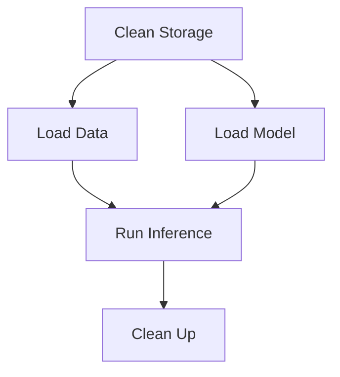

# Apache Airflow Pipelines

Apache Airflow is a platform for programmatically authoring, scheduling, and monitoring workflows. In this module, we use Airflow with the `KubernetesPodOperator` to run ML workloads as containerized pods on Kubernetes.

## Installation & Setup

<Steps>
  <Step title="Install Airflow">
    Install Apache Airflow with Kubernetes provider:
    ```bash
    AIRFLOW_VERSION=2.9.3
    PYTHON_VERSION="$(python --version | cut -d " " -f 2 | cut -d "." -f 1-2)"
    CONSTRAINT_URL="https://raw.githubusercontent.com/apache/airflow/constraints-${AIRFLOW_VERSION}/constraints-${PYTHON_VERSION}.txt"
    pip install "apache-airflow==${AIRFLOW_VERSION}" --constraint "${CONSTRAINT_URL}"
    pip install apache-airflow-providers-cncf-kubernetes==8.3.3
    ```
  </Step>
  
  <Step title="Configure Environment">
    Set Airflow home directory and disable example DAGs:
    ```bash
    export AIRFLOW_HOME=$PWD/airflow_pipelines
    export AIRFLOW__CORE__LOAD_EXAMPLES=False
    export WANDB_PROJECT=your-project
    export WANDB_API_KEY=your-key
    ```
  </Step>
  
  <Step title="Create Kubernetes Storage">
    Apply PersistentVolume and PersistentVolumeClaim for pipeline storage:
    ```bash
    kubectl create -f ./airflow_pipelines/volumes.yaml
    ```
    
    <Accordion title="volumes.yaml">
    ```yaml
    apiVersion: v1
    kind: PersistentVolume
    metadata:
      name: training-storage
    spec:
      capacity:
        storage: 5Gi
      accessModes:
      - ReadWriteMany
      persistentVolumeReclaimPolicy: Delete
      storageClassName: local-storage
      local:
        path: /tmp/
      nodeAffinity:
        required:
          nodeSelectorTerms:
          - matchExpressions:
            - key: kubernetes.io/hostname
              operator: In
              values:
              - ml-in-production-control-plane
    ---
    apiVersion: v1
    kind: PersistentVolumeClaim
    metadata:
      name: training-storage
    spec:
      accessModes:
      - ReadWriteMany
      resources:
        requests:
          storage: 5Gi
      storageClassName: local-storage
    ```
    </Accordion>
  </Step>
  
  <Step title="Start Airflow">
    Run Airflow in standalone mode:
    ```bash
    airflow standalone
    ```
    
    Access the UI at `http://0.0.0.0:8080`
  </Step>
</Steps>

## Training DAG

The training DAG orchestrates the full model training lifecycle using `KubernetesPodOperator` to run containerized tasks.

### DAG Definition

```python airflow_pipelines/dags/training_dag.py
import os
from datetime import datetime

from airflow import DAG
from airflow.providers.cncf.kubernetes.operators.pod import KubernetesPodOperator
from kubernetes.client import models as k8s

DOCKER_IMAGE = "ghcr.io/kyryl-opens-ml/classic-example:main"
STORAGE_NAME = "training-storage"
WANDB_PROJECT = os.getenv("WANDB_PROJECT")
WANDB_API_KEY = os.getenv("WANDB_API_KEY")

# Configure persistent volume for data sharing between tasks
volume = k8s.V1Volume(
    name=STORAGE_NAME,
    persistent_volume_claim=k8s.V1PersistentVolumeClaimVolumeSource(
        claim_name=STORAGE_NAME
    ),
)
volume_mount = k8s.V1VolumeMount(name=STORAGE_NAME, mount_path="/tmp/", sub_path=None)

with DAG(
    start_date=datetime(2021, 1, 1),
    catchup=False,
    schedule_interval=None,  # Manual trigger only
    dag_id="training_dag",
) as dag:
    # Task 1: Clean storage before starting
    clean_storage_before_start = KubernetesPodOperator(
        name="clean_storage_before_start",
        image=DOCKER_IMAGE,
        cmds=["rm", "-rf", "/tmp/*"],
        task_id="clean_storage_before_start",
        is_delete_operator_pod=False,
        namespace="default",
        startup_timeout_seconds=600,
        image_pull_policy="Always",
        volumes=[volume],
        volume_mounts=[volume_mount],
    )

    # Task 2: Load training data (SST-2 dataset)
    load_data = KubernetesPodOperator(
        name="load_data",
        image=DOCKER_IMAGE,
        cmds=["python", "classic_example/cli.py", "load-sst2-data", "/tmp/data/"],
        task_id="load_data",
        in_cluster=False,
        is_delete_operator_pod=False,
        namespace="default",
        startup_timeout_seconds=600,
        image_pull_policy="Always",
        volumes=[volume],
        volume_mounts=[volume_mount],
    )

    # Task 3: Train the model
    train_model = KubernetesPodOperator(
        name="train_model",
        image=DOCKER_IMAGE,
        cmds=[
            "python",
            "classic_example/cli.py",
            "train",
            "tests/data/test_config.json",
        ],
        task_id="train_model",
        in_cluster=False,
        is_delete_operator_pod=False,
        namespace="default",
        startup_timeout_seconds=600,
        image_pull_policy="Always",
        volumes=[volume],
        volume_mounts=[volume_mount],
    )

    # Task 4: Upload model to W&B registry
    upload_model = KubernetesPodOperator(
        name="upload_model",
        image=DOCKER_IMAGE,
        cmds=[
            "python",
            "classic_example/cli.py",
            "upload-to-registry",
            "airflow-pipeline",
            "/tmp/results",
        ],
        task_id="upload_model",
        env_vars={"WANDB_PROJECT": WANDB_PROJECT, "WANDB_API_KEY": WANDB_API_KEY},
        in_cluster=False,
        is_delete_operator_pod=False,
        namespace="default",
        startup_timeout_seconds=600,
        image_pull_policy="Always",
        volumes=[volume],
        volume_mounts=[volume_mount],
    )

    # Task 5: Clean up storage
    clean_up = KubernetesPodOperator(
        name="clean_up",
        image=DOCKER_IMAGE,
        cmds=["rm", "-rf", "/tmp/*"],
        task_id="clean_up",
        in_cluster=False,
        is_delete_operator_pod=False,
        namespace="default",
        startup_timeout_seconds=600,
        image_pull_policy="Always",
        volumes=[volume],
        volume_mounts=[volume_mount],
        trigger_rule="all_done",  # Run even if upstream tasks fail
    )

    # Define task dependencies
    clean_storage_before_start >> load_data >> train_model >> upload_model >> clean_up
```

### Key Components

<AccordionGroup>
  <Accordion title="KubernetesPodOperator">
    Runs tasks as Kubernetes pods, providing:
    - **Isolation**: Each task runs in its own container
    - **Resource management**: Kubernetes handles pod scheduling and resources
    - **Image flexibility**: Use any Docker image with required dependencies
    - **Volume mounting**: Share data between tasks via PersistentVolumes
  </Accordion>
  
  <Accordion title="Volume Configuration">
    PersistentVolumes enable data sharing:
    ```python
    volume = k8s.V1Volume(
        name="training-storage",
        persistent_volume_claim=k8s.V1PersistentVolumeClaimVolumeSource(
            claim_name="training-storage"
        ),
    )
    volume_mount = k8s.V1VolumeMount(
        name="training-storage", 
        mount_path="/tmp/"
    )
    ```
    All tasks mount `/tmp/` to share training data and model artifacts.
  </Accordion>
  
  <Accordion title="Task Dependencies">
    Airflow uses `>>` operator to define execution order:
    ```python
    clean_storage_before_start >> load_data >> train_model >> upload_model >> clean_up
    ```
    This ensures tasks run sequentially, with each task completing before the next starts.
  </Accordion>
</AccordionGroup>

## Inference DAG

The inference DAG loads a trained model from the registry and runs predictions on new data.

### DAG Definition

```python airflow_pipelines/dags/inference_dag.py
with DAG(
    start_date=datetime(2021, 1, 1),
    catchup=False,
    schedule_interval="0 9 * * *",  # Daily at 9 AM UTC
    dag_id="inference_dag",
) as dag:
    clean_storage_before_start = KubernetesPodOperator(
        name="clean_storage_before_start",
        image=DOCKER_IMAGE,
        cmds=["rm", "-rf", "/tmp/data/*"],
        task_id="clean_storage_before_start",
        # ... configuration ...
    )

    load_data = KubernetesPodOperator(
        name="load_data",
        image=DOCKER_IMAGE,
        cmds=["python", "classic_example/cli.py", "load-sst2-data", "/tmp/data/"],
        task_id="load_data",
        # ... configuration ...
    )

    load_model = KubernetesPodOperator(
        name="load_model",
        image=DOCKER_IMAGE,
        cmds=[
            "python",
            "classic_example/cli.py",
            "load-from-registry",
            "airflow-pipeline:latest",
            "/tmp/results/",
        ],
        task_id="load_model",
        env_vars={"WANDB_PROJECT": WANDB_PROJECT, "WANDB_API_KEY": WANDB_API_KEY},
        # ... configuration ...
    )

    run_inference = KubernetesPodOperator(
        name="run_inference",
        image=DOCKER_IMAGE,
        cmds=[
            "python",
            "classic_example/cli.py",
            "run-inference-on-dataframe",
            "/tmp/data/test.csv",
            "/tmp/results/",
            "/tmp/pred.csv",
        ],
        task_id="run_inference",
        # ... configuration ...
    )

    clean_up = KubernetesPodOperator(
        name="clean_up",
        image=DOCKER_IMAGE,
        cmds=["rm", "-rf", "/tmp/data/*"],
        task_id="clean_up",
        trigger_rule="all_done",
        # ... configuration ...
    )

    # Parallel execution: load_data and load_model run simultaneously
    clean_storage_before_start >> load_data
    clean_storage_before_start >> load_model
    
    # Both must complete before inference
    load_data >> run_inference
    load_model >> run_inference
    run_inference >> clean_up
```

### Parallel Task Execution

Unlike the training DAG, the inference DAG runs `load_data` and `load_model` **in parallel** since they're independent:



## Running Pipelines

<Tabs>
  <Tab title="Trigger Single Run">
    Manually trigger a pipeline:
    ```bash
    airflow dags trigger training_dag
    airflow dags trigger inference_dag
    ```
  </Tab>
  
  <Tab title="Trigger Multiple Runs">
    Run 5 training jobs sequentially:
    ```bash
    for i in {1..5}; do 
      airflow dags trigger training_dag
      sleep 1
    done
    ```
    
    Run 5 inference jobs:
    ```bash
    for i in {1..5}; do 
      airflow dags trigger inference_dag
      sleep 1
    done
    ```
  </Tab>
  
  <Tab title="Monitor in UI">
    1. Open `http://0.0.0.0:8080`
    2. Navigate to **DAGs** view
    3. Click on `training_dag` or `inference_dag`
    4. View **Graph**, **Tree**, or **Gantt** views to monitor execution
  </Tab>
</Tabs>

## Best Practices

<CardGroup cols={2}>
  <Card title="Volume Management" icon="database">
    - Use PersistentVolumes for data sharing
    - Clean up storage between runs
    - Set `trigger_rule="all_done"` for cleanup tasks
  </Card>
  
  <Card title="Resource Configuration" icon="server">
    - Set appropriate `startup_timeout_seconds`
    - Use `image_pull_policy="Always"` for latest images
    - Configure resource requests/limits as needed
  </Card>
  
  <Card title="Error Handling" icon="shield-halved">
    - Set `is_delete_operator_pod=False` for debugging
    - Use `trigger_rule` to control failure behavior
    - Monitor pod logs via kubectl or k9s
  </Card>
  
  <Card title="Security" icon="lock">
    - Store credentials in environment variables
    - Use Airflow Connections for external services
    - Avoid hardcoding API keys in DAG code
  </Card>
</CardGroup>

## Troubleshooting

<AccordionGroup>
  <Accordion title="Pod Startup Timeouts">
    If pods fail to start within 600 seconds:
    - Check cluster resources: `kubectl top nodes`
    - Verify image pull: `kubectl get pods -n default`
    - Increase `startup_timeout_seconds` if needed
  </Accordion>
  
  <Accordion title="Volume Mount Errors">
    If volume mounting fails:
    ```bash
    # Check PersistentVolumes
    kubectl get pv
    
    # Check PersistentVolumeClaims
    kubectl get pvc
    
    # Recreate if needed
    kubectl delete -f volumes.yaml
    kubectl create -f volumes.yaml
    ```
  </Accordion>
  
  <Accordion title="DAG Not Appearing in UI">
    If your DAG doesn't show up:
    - Check DAG file syntax: `airflow dags list`
    - Verify `AIRFLOW_HOME` points to correct directory
    - Look for errors: `airflow dags list-import-errors`
  </Accordion>
</AccordionGroup>

## Additional Resources

- [KubernetesPodOperator Documentation](https://airflow.apache.org/docs/apache-airflow-providers-cncf-kubernetes/stable/operators.html)
- [AI + ML DAG Examples](https://registry.astronomer.io/dags?categoryName=AI+%2B+Machine+Learning&limit=24&sorts=updatedAt%3Adesc)
- [Pass Data Between Tasks](https://www.astronomer.io/docs/learn/airflow-passing-data-between-tasks)

## Next Steps

<Card title="Try Kubeflow Pipelines" icon="arrow-right" href="/modules/module-4/kubeflow">
  Learn Kubernetes-native ML orchestration with built-in artifact tracking
</Card>
