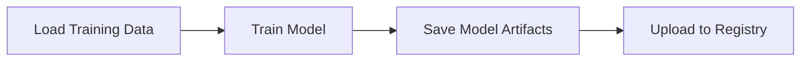
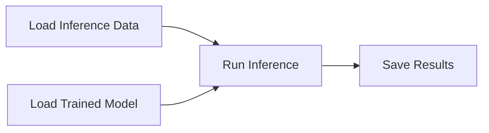

# Pipeline Orchestration

This module demonstrates how to build end-to-end training and inference pipelines using three popular orchestration frameworks: Apache Airflow, Kubeflow Pipelines, and Dagster.

## Why Pipeline Orchestration?

Pipeline orchestration tools help you:

- **Modularize workflows**: Break complex ML workflows into manageable, reusable components
- **Schedule and automate**: Run training and inference jobs on schedules or triggers
- **Track dependencies**: Automatically manage task dependencies and execution order
- **Monitor execution**: Visualize pipeline runs, debug failures, and track metrics
- **Scale workloads**: Run computationally intensive tasks on Kubernetes or distributed systems

## Orchestration Frameworks

<CardGroup cols={3}>
  <Card title="Apache Airflow" icon="wind" href="/modules/module-4/airflow">
    General-purpose workflow orchestration with KubernetesPodOperator
  </Card>
  <Card title="Kubeflow Pipelines" icon="cube" href="/modules/module-4/kubeflow">
    Kubernetes-native ML pipeline orchestration with artifact tracking
  </Card>
  <Card title="Dagster" icon="diagram-project" href="/modules/module-4/dagster">
    Asset-centric data orchestration with built-in data quality checks
  </Card>
</CardGroup>

## Pipeline Architecture

Both training and inference pipelines follow a consistent structure:

### Training Pipeline



**Key Steps:**
1. **Load Training Data**: Download or prepare datasets (e.g., SST-2, SQL context data)
2. **Train Model**: Fine-tune models with specified configurations
3. **Save Artifacts**: Store model weights, tokenizers, and configs
4. **Upload to Registry**: Push trained models to W&B or other registries

### Inference Pipeline



**Key Steps:**
1. **Load Inference Data**: Prepare input data for predictions
2. **Load Trained Model**: Fetch model artifacts from registry
3. **Run Inference**: Generate predictions using loaded model
4. **Save Results**: Store predictions and evaluation metrics

## Prerequisites

<Steps>
  <Step title="Create Kubernetes Cluster">
    Create a local Kind cluster for running orchestrated workloads:
    ```bash
    kind create cluster --name ml-in-production
    ```
  </Step>
  
  <Step title="Set Environment Variables">
    Configure W&B credentials for model tracking:
    ```bash
    export WANDB_PROJECT=your-project-name
    export WANDB_API_KEY=your-api-key
    ```
  </Step>
  
  <Step title="Monitor with k9s (Optional)">
    Use k9s for real-time cluster monitoring:
    ```bash
    k9s -A
    ```
  </Step>
</Steps>

## Framework Comparison

| Feature | Airflow | Kubeflow | Dagster |
|---------|---------|----------|----------|
| **Primary Focus** | General workflow orchestration | ML-specific pipelines | Data/asset orchestration |
| **Kubernetes Native** | Via operators | Yes | Via executors |
| **Artifact Tracking** | External tools | Built-in | Built-in |
| **Data Quality Checks** | Custom operators | Limited | Asset checks |
| **UI/Visualization** | Web UI (DAGs) | Web UI (pipelines) | Web UI (assets) |
| **Learning Curve** | Moderate | Moderate-High | Moderate |
| **Best For** | Complex scheduling | K8s ML workflows | Data quality focus |

## Learning Objectives

By completing this module, you'll be able to:

- Deploy and configure Airflow, Kubeflow, and Dagster
- Build training pipelines that load data, train models, and upload artifacts
- Create inference pipelines that fetch models and generate predictions
- Compare orchestration frameworks for your ML use case
- Integrate with W&B for experiment tracking
- Run containerized workloads on Kubernetes

## Module Resources

- [Airflow Setup & DAGs](/modules/module-4/airflow)
- [Kubeflow Pipelines](/modules/module-4/kubeflow)
- [Dagster Assets & Checks](/modules/module-4/dagster)
- [Practice Exercises](/modules/module-4/practice)

## Additional Reading

- [Why data scientists shouldn't need to know Kubernetes](https://huyenchip.com/2021/09/13/data-science-infrastructure.html)
- [Orchestration for Machine Learning](https://madewithml.com/courses/mlops/orchestration/)
- [Awesome Open Source Workflow Engines](https://github.com/meirwah/awesome-workflow-engines)
- [How we Reduced our ML Training Costs by 78%](https://blog.gofynd.com/how-we-reduced-our-ml-training-costs-by-78-a33805cb00cf)
