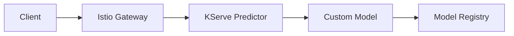

## Overview

KServe provides a standardized, serverless inference platform built on Kubernetes. It offers automatic scaling, canary deployments, and seamless integration with Istio for traffic management.

## Architecture

KServe uses a **two-component architecture**:

1. **InferenceService**: Kubernetes CRD defining the model serving configuration
2. **Custom Model**: Python implementation of the prediction logic



## Custom Model Implementation

### Model Class

The custom model (`serving/kserve_api.py`) extends KServe's base `Model` class:

```python serving/kserve_api.py
from kserve import Model, ModelServer
from serving.predictor import Predictor
from typing import Dict

class CustomModel(Model):
    def __init__(self, name: str):
        super().__init__(name)
        self.name = name
        self.load()

    def load(self):
        self.predictor = Predictor.default_from_model_registry()
        self.ready = True

    def predict(self, payload: Dict, headers: Dict[str, str] = None) -> Dict:
        print(payload)
        print(type(payload))
        instances = payload["instances"]
        predictions = self.predictor.predict(instances)
        return {"predictions": predictions.tolist()}

if __name__ == "__main__":
    model = CustomModel("custom-model")
    ModelServer().start([model])
```

**Key methods:**
- `__init__`: Initialize model name and trigger loading
- `load`: Download model from registry and set ready state
- `predict`: Handle inference requests with standard payload format

### Lifecycle Management

<Steps>
  <Step title="Initialization">
    `__init__` is called when the container starts
  </Step>
  
  <Step title="Model Loading">
    `load()` downloads model from W&B and sets `self.ready = True`
  </Step>
  
  <Step title="Health Checks">
    KServe checks `self.ready` for liveness/readiness probes
  </Step>
  
  <Step title="Request Handling">
    `predict()` is called for each inference request
  </Step>
</Steps>

## Request/Response Protocol

### V1 Inference Protocol

KServe uses a standardized format:

<CodeGroup>
```json Request Format
{
  "instances": ["good", "bad123"]
}
```

```json Response Format
{
  "predictions": [
    [0.23, 0.77],
    [0.89, 0.11]
  ]
}
```
</CodeGroup>

**Protocol specification:**
- `instances`: List of input data (any JSON-serializable type)
- `predictions`: List of outputs matching input order

### Input Parsing

```python
def predict(self, payload: Dict, headers: Dict[str, str] = None) -> Dict:
    instances = payload["instances"]
    predictions = self.predictor.predict(instances)
    return {"predictions": predictions.tolist()}
```

**Supported formats:**
- Strings: `["text1", "text2"]`
- Numbers: `[[1, 2, 3], [4, 5, 6]]`
- Objects: `[{"text": "...", "id": 1}]`

## Kubernetes Deployment

### InferenceService Manifest

```yaml k8s/kserve-inferenceserver.yaml
apiVersion: serving.kserve.io/v1beta1
kind: InferenceService
metadata:
  name: custom-model
spec:
  predictor:
    containers:
      - name: kserve-container
        image: ghcr.io/kyryl-opens-ml/app-kserve:latest
        env:
        - name: WANDB_API_KEY
          valueFrom:
            secretKeyRef:
              name: wandb
              key: WANDB_API_KEY
```

**Manifest structure:**
- `InferenceService`: Custom Resource Definition (CRD)
- `predictor`: Container running the model server
- `env`: Environment variables (secrets, config)

### Installation

<Steps>
  <Step title="Install KServe">
    ```bash
    curl -s "https://raw.githubusercontent.com/kserve/kserve/release-0.13/hack/quick_install.sh" | bash
    ```
    
    This installs:
    - KServe operator
    - Istio for traffic management
    - Knative Serving for autoscaling
    - Cert-manager for TLS
  </Step>
  
  <Step title="Verify installation">
    ```bash
    kubectl get pods -n kserve
    kubectl get pods -n istio-system
    ```
  </Step>
  
  <Step title="Create secrets">
    ```bash
    export WANDB_API_KEY='your-key'
    kubectl create secret generic wandb \
      --from-literal=WANDB_API_KEY=$WANDB_API_KEY
    ```
  </Step>
  
  <Step title="Deploy model">
    ```bash
    kubectl create -f k8s/kserve-inferenceserver.yaml
    ```
  </Step>
  
  <Step title="Check status">
    ```bash
    kubectl get inferenceservices
    kubectl get pods -l serving.kserve.io/inferenceservice=custom-model
    ```
  </Step>
</Steps>

### Accessing the Service

#### Port Forwarding

```bash
kubectl port-forward --namespace istio-system \
  svc/istio-ingressgateway 8080:80
```

#### Making Requests

```bash
curl -v \
  -H "Host: custom-model.default.example.com" \
  -H "Content-Type: application/json" \
  "http://localhost:8080/v1/models/custom-model:predict" \
  -d @data-samples/kserve-input.json
```

**Request components:**
- `Host` header: Routes to correct InferenceService
- URL path: `/v1/models/{model-name}:predict`
- Input file: `kserve-input.json` with instances

**Expected response:**
```json
{
  "predictions": [
    [0.23, 0.77],
    [0.89, 0.11]
  ]
}
```

## Advanced Features

### Autoscaling

KServe automatically scales based on request load:

```yaml
apiVersion: serving.kserve.io/v1beta1
kind: InferenceService
metadata:
  name: custom-model
spec:
  predictor:
    minReplicas: 1
    maxReplicas: 10
    scaleTarget: 10  # Concurrent requests per pod
    containers:
      - name: kserve-container
        image: ghcr.io/kyryl-opens-ml/app-kserve:latest
```

**Scaling behavior:**
- Scales to zero when idle (after 60s by default)
- Scales up based on concurrent requests
- Cold start latency: 5-15 seconds

### Canary Deployments

Deploy new model versions with traffic splitting:

```yaml
apiVersion: serving.kserve.io/v1beta1
kind: InferenceService
metadata:
  name: custom-model
spec:
  predictor:
    containers:
      - name: kserve-container
        image: ghcr.io/kyryl-opens-ml/app-kserve:v2
    canaryTrafficPercent: 20  # 20% to new version
```

**Use cases:**
- A/B testing model versions
- Gradual rollout of new models
- Risk mitigation for model updates

### Transformer (Preprocessing)

Add preprocessing before prediction:

```yaml
spec:
  transformer:
    containers:
      - name: transformer
        image: ghcr.io/kyryl-opens-ml/transformer:latest
  predictor:
    containers:
      - name: kserve-container
        image: ghcr.io/kyryl-opens-ml/app-kserve:latest
```

**Transformer implementation:**

```python
class CustomTransformer(Model):
    def preprocess(self, payload: Dict, headers: Dict = None) -> Dict:
        # Clean and tokenize text
        instances = payload["instances"]
        cleaned = [clean_text(text) for text in instances]
        return {"instances": cleaned}
```

### Explainer (Post-processing)

Add model explanations:

```yaml
spec:
  predictor:
    containers:
      - name: kserve-container
        image: ghcr.io/kyryl-opens-ml/app-kserve:latest
  explainer:
    containers:
      - name: explainer
        image: ghcr.io/kyryl-opens-ml/explainer:latest
```

## Monitoring and Logging

### View Logs

```bash
# Get pod name
kubectl get pods -l serving.kserve.io/inferenceservice=custom-model

# View logs
kubectl logs <pod-name> kserve-container -f
```

### Metrics

KServe exposes Prometheus metrics:

```bash
# Port forward to metrics endpoint
kubectl port-forward <pod-name> 9090:9090

# Query metrics
curl http://localhost:9090/metrics
```

**Key metrics:**
- `request_total`: Total requests
- `request_duration_seconds`: Latency distribution
- `request_failure_total`: Failed requests

### Health Checks

KServe provides built-in endpoints:

```bash
# Liveness probe
curl http://localhost:8080/v1/models/custom-model

# Readiness probe (checks self.ready)
curl http://localhost:8080/v1/models/custom-model/ready
```

## Local Development

### Build and Run

```bash
# Build
make build_kserve

# Run locally
make run_kserve
```

This starts the server on port 8081:

```bash
# Test locally
curl -X POST \
  -H "Content-Type: application/json" \
  -d '{"instances": ["test"]}' \
  http://localhost:8081/v1/models/custom-model:predict
```

## Troubleshooting

<AccordionGroup>
  <Accordion title="InferenceService not ready">
    **Problem:** `kubectl get isvc` shows `Unknown` or `False`
    
    **Solutions:**
    ```bash
    # Check events
    kubectl describe inferenceservice custom-model
    
    # Check pod status
    kubectl get pods -l serving.kserve.io/inferenceservice=custom-model
    kubectl logs <pod-name> -c kserve-container
    
    # Common issues:
    # - Missing secrets (WANDB_API_KEY)
    # - Image pull errors
    # - Model loading failures
    ```
  </Accordion>
  
  <Accordion title="404 errors on requests">
    **Problem:** Requests fail with 404 Not Found
    
    **Solutions:**
    - Verify Host header matches service name
    - Check Istio gateway is running
    - Ensure URL path is correct: `/v1/models/{name}:predict`
    - Test with verbose curl: `curl -v`
  </Accordion>
  
  <Accordion title="Slow cold starts">
    **Problem:** First request takes >30 seconds
    
    **Solutions:**
    - Set `minReplicas: 1` to prevent scale-to-zero
    - Use init containers for model download
    - Cache model in persistent volume
    - Optimize image size
  </Accordion>
</AccordionGroup>

## Comparison: KServe vs Alternatives

| Feature | KServe | Seldon Core | BentoML |
|---------|--------|-------------|----------|
| Kubernetes native | Yes | Yes | Partial |
| Autoscaling | Excellent | Good | Limited |
| Multi-framework | Yes | Yes | Yes |
| Canary deployments | Built-in | Via Istio | Manual |
| Complexity | Medium | High | Low |
| Community | Large | Large | Growing |

**Choose KServe when:**
- Running on Kubernetes
- Need autoscaling and canary deployments
- Want standardized inference protocol
- Using Istio service mesh

## Best Practices

<CardGroup cols={2}>
  <Card title="Resource Limits" icon="gauge">
    Set appropriate CPU/memory limits to prevent OOM
  </Card>
  <Card title="Model Caching" icon="database">
    Use persistent volumes for faster restarts
  </Card>
  <Card title="Health Checks" icon="heart-pulse">
    Implement comprehensive health checks in `load()`
  </Card>
  <Card title="Monitoring" icon="chart-line">
    Export custom metrics for model-specific monitoring
  </Card>
</CardGroup>

## Production Checklist

<Check>
- Configure resource requests/limits
- Set up persistent volume for model cache
- Enable Prometheus metrics scraping
- Configure HPA for autoscaling
- Set up logging aggregation
- Implement request timeouts
- Add authentication/authorization
- Configure TLS certificates
</Check>

## Next Steps

<Card title="vLLM Serving" icon="brain" href="/modules/module-5/vllm">
  Serve large language models with vLLM and LoRA adapters
</Card>

## Resources

- [KServe Documentation](https://kserve.github.io/website/)
- [KServe GitHub](https://github.com/kserve/kserve)
- [Inference Protocol](https://kserve.github.io/website/modelserving/data_plane/v2_protocol/)
- [Knative Serving](https://knative.dev/docs/serving/)