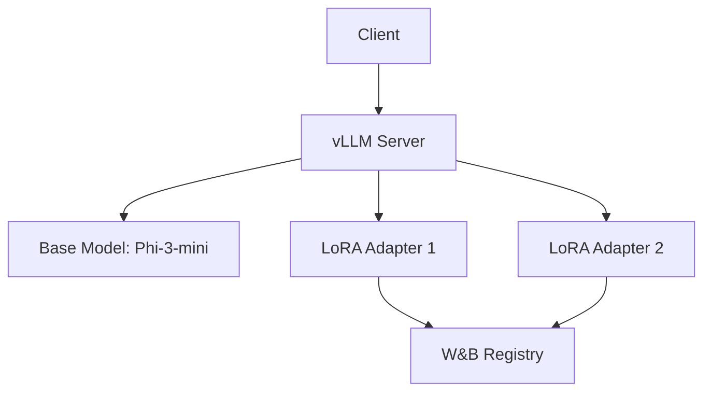

## Overview

vLLM is a high-throughput, memory-efficient inference engine for large language models. It supports:

- **PagedAttention**: Efficient memory management for KV cache
- **Continuous batching**: Dynamic request batching for high throughput
- **LoRA adapters**: Runtime loading of fine-tuned adapters
- **OpenAI-compatible API**: Drop-in replacement for OpenAI clients

## Architecture



**Key components:**
- **vLLM Server**: Serves base model with OpenAI API
- **LoRA Adapters**: Task-specific fine-tuned weights
- **Model Registry**: W&B artifact storage
- **Client**: Python client for adapter management

## Server Configuration

### Command Line Setup

```bash
# Enable runtime LoRA updates
export VLLM_ALLOW_RUNTIME_LORA_UPDATING=True

# Start server
vllm serve microsoft/Phi-3-mini-4k-instruct \
  --dtype auto \
  --max-model-len 512 \
  --enable-lora \
  --gpu-memory-utilization 0.8 \
  --download-dir ./vllm-storage
```

**Parameter breakdown:**

| Parameter | Purpose | Value |
|-----------|---------|-------|
| `--dtype` | Data type for weights | `auto` (FP16/BF16) |
| `--max-model-len` | Maximum sequence length | 512 tokens |
| `--enable-lora` | Enable LoRA adapter support | Required |
| `--gpu-memory-utilization` | GPU memory fraction | 0.8 (80%) |
| `--download-dir` | Model cache directory | `./vllm-storage` |

<Warning>
Set `VLLM_ALLOW_RUNTIME_LORA_UPDATING=True` to load adapters after server start.
</Warning>

### Storage Requirements

```bash
mkdir -p vllm-storage
```

**Disk space:**
- Base model (Phi-3-mini): ~7 GB
- LoRA adapters: ~50-100 MB each
- Total recommended: 50 GB for multiple adapters

## Client Implementation

### CLI Tool

The client (`serving-llm/client.py`) provides commands for adapter management:

```python serving-llm/client.py
import requests
import wandb
from openai import OpenAI
from pathlib import Path

DEFAULT_BASE_URL = "http://localhost:8000/v1"

def load_from_registry(model_name: str, model_path: Path):
    with wandb.init() as run:
        artifact = run.use_artifact(model_name, type="model")
        artifact_dir = artifact.download(root=model_path)
        print(f"{artifact_dir}")

def load_adapter(lora_name: str, lora_path: str, url: str = DEFAULT_BASE_URL):
    url = f"{url}/load_lora_adapter"
    payload = {"lora_name": lora_name, "lora_path": lora_path}
    response = requests.post(url, json=payload)
    print(response)

def list_of_models(url: str = DEFAULT_BASE_URL):
    url = f"{url}/models"
    response = requests.get(url)
    models = response.json()
    print(json.dumps(models, indent=4))

def test_client(
    model: str,
    context: str = EXAMPLE_CONTEXT,
    query: str = EXAMPLE_QUERY,
    url: str = DEFAULT_BASE_URL,
):
    client = OpenAI(base_url=url, api_key="any-api-key")
    messages = [{"content": f"{context}\n Input: {query}", "role": "user"}]
    completion = client.chat.completions.create(model=model, messages=messages)
    print(completion.choices[0].message.content)
```

### Client Commands

<Tabs>
  <Tab title="List Models">
    ```bash
    python serving-llm/client.py list-of-models
    ```
    
    **Output:**
    ```json
    {
      "object": "list",
      "data": [
        {
          "id": "microsoft/Phi-3-mini-4k-instruct",
          "object": "model",
          "owned_by": "vllm"
        },
        {
          "id": "sql-default-model",
          "object": "model",
          "owned_by": "vllm"
        }
      ]
    }
    ```
  </Tab>
  
  <Tab title="Load from Registry">
    ```bash
    python serving-llm/client.py load-from-registry \
      truskovskiyk/ml-in-production-practice/modal_generative_example:latest \
      sql-default-model
    ```
    
    Downloads LoRA adapter from W&B to `./sql-default-model/`
  </Tab>
  
  <Tab title="Load Adapter">
    ```bash
    python serving-llm/client.py load-adapter \
      sql-default-model \
      ./sql-default-model
    ```
    
    Registers adapter with vLLM server at runtime
  </Tab>
  
  <Tab title="Test Inference">
    ```bash
    # Base model
    python serving-llm/client.py test-client \
      microsoft/Phi-3-mini-4k-instruct
    
    # LoRA adapter
    python serving-llm/client.py test-client \
      sql-default-model
    ```
  </Tab>
</Tabs>

## Adapter Management

### Loading Workflow

<Steps>
  <Step title="Download from registry">
    ```bash
    python serving-llm/client.py load-from-registry \
      truskovskiyk/ml-in-production-practice/modal_generative_example:latest \
      sql-default-model
    ```
    
    Downloads adapter weights to local directory
  </Step>
  
  <Step title="Register with vLLM">
    ```bash
    python serving-llm/client.py load-adapter \
      sql-default-model \
      ./sql-default-model
    ```
    
    Sends POST request to `/v1/load_lora_adapter`
  </Step>
  
  <Step title="Verify loading">
    ```bash
    python serving-llm/client.py list-of-models
    ```
    
    Check adapter appears in model list
  </Step>
  
  <Step title="Test inference">
    ```bash
    python serving-llm/client.py test-client sql-default-model
    ```
    
    Run sample query with adapter
  </Step>
</Steps>

### Unloading Adapters

```python
def unload_adapter(lora_name: str, url: str = DEFAULT_BASE_URL):
    url = f"{url}/unload_lora_adapter"
    payload = {"lora_name": lora_name}
    response = requests.post(url, json=payload)
    result = response.json()
    print(json.dumps(result, indent=4))
```

**Usage:**
```bash
python serving-llm/client.py unload-adapter sql-default-model
```

## OpenAI Client Integration

### Chat Completions

```python
from openai import OpenAI

client = OpenAI(
    base_url="http://localhost:8000/v1",
    api_key="any-api-key"  # Not validated by vLLM
)

# Use base model
response = client.chat.completions.create(
    model="microsoft/Phi-3-mini-4k-instruct",
    messages=[{"role": "user", "content": "Translate to SQL: Show all users"}]
)

print(response.choices[0].message.content)
```

### Using LoRA Adapters

```python
# Use loaded adapter
response = client.chat.completions.create(
    model="sql-default-model",  # Adapter name
    messages=[
        {
            "role": "user",
            "content": f"{database_schema}\n Input: {natural_language_query}"
        }
    ]
)

print(response.choices[0].message.content)
```

**Example context:**
```python
EXAMPLE_CONTEXT = """
CREATE TABLE salesperson (
    salesperson_id INT,
    name TEXT,
    region TEXT
);

CREATE TABLE timber_sales (
    sales_id INT,
    salesperson_id INT,
    volume REAL,
    sale_date DATE
);
"""

EXAMPLE_QUERY = "What is the total volume of timber sold by each salesperson?"
```

## Kubernetes Deployment

### Manifest Structure

```yaml k8s/vllm-inference.yaml
apiVersion: v1
kind: PersistentVolumeClaim
metadata:
  name: vllm-storage-pvc
spec:
  accessModes:
    - ReadWriteOnce
  resources:
    requests:
      storage: 50Gi
  storageClassName: standard
---
apiVersion: apps/v1
kind: Deployment
metadata:
  name: app-vllm
spec:
  replicas: 1
  template:
    spec:
      containers:
        # Main vLLM server
        - name: app-vllm
          image: vllm/vllm-openai:latest
          env:
            - name: VLLM_ALLOW_RUNTIME_LORA_UPDATING
              value: "True"
          command: ["vllm"]
          args:
            - "serve"
            - "microsoft/Phi-3-mini-4k-instruct"
            - "--dtype"
            - "auto"
            - "--max-model-len"
            - "512"
            - "--enable-lora"
            - "--gpu-memory-utilization"
            - "0.8"
            - "--download-dir"
            - "/vllm-storage"
          resources:
            limits:
              nvidia.com/gpu: 1
          volumeMounts:
            - name: vllm-storage
              mountPath: /vllm-storage
        
        # Init container for adapter loading
        - name: model-loader
          image: ghcr.io/kyryl-opens-ml/app-fastapi:latest
          command: ["/bin/sh", "-c"]
          args:
            - |
              echo "Waiting for vLLM server..."
              while ! curl -s http://localhost:8000/health >/dev/null; do
                sleep 5
              done
              
              echo "Loading adapter from registry..."
              python serving-llm/client.py load-from-registry \
                truskovskiyk/ml-in-production-practice/modal_generative_example:latest \
                sql-default-model
              
              python serving-llm/client.py load-adapter \
                sql-default-model \
                ./sql-default-model
              
              echo "Adapter loaded successfully"
          volumeMounts:
            - name: vllm-storage
              mountPath: /vllm-storage
      
      volumes:
        - name: vllm-storage
          persistentVolumeClaim:
            claimName: vllm-storage-pvc
```

**Architecture:**
- **PVC**: Persistent storage for models and adapters
- **app-vllm**: Main container running vLLM server
- **model-loader**: Sidecar that downloads and registers adapters

### Deployment Steps

<Steps>
  <Step title="Create GPU cluster">
    ```bash
    # For Minikube with GPU support
    curl -LO https://storage.googleapis.com/minikube/releases/latest/minikube_latest_amd64.deb
    sudo dpkg -i minikube_latest_amd64.deb
    minikube start --driver docker --container-runtime docker --gpus all
    ```
  </Step>
  
  <Step title="Create secrets">
    ```bash
    export WANDB_API_KEY='your-key'
    kubectl create secret generic wandb \
      --from-literal=WANDB_API_KEY=$WANDB_API_KEY
    ```
  </Step>
  
  <Step title="Deploy vLLM">
    ```bash
    kubectl create -f k8s/vllm-inference.yaml
    ```
  </Step>
  
  <Step title="Monitor startup">
    ```bash
    # Check main container
    kubectl logs -l app=app-vllm -c app-vllm -f
    
    # Check model loader
    kubectl logs -l app=app-vllm -c model-loader -f
    ```
  </Step>
  
  <Step title="Port forward">
    ```bash
    kubectl port-forward --address 0.0.0.0 svc/app-vllm 8000:8000
    ```
  </Step>
</Steps>

### Testing Deployment

```bash
# List models
python serving-llm/client.py list-of-models

# Test base model
python serving-llm/client.py test-client microsoft/Phi-3-mini-4k-instruct

# Test adapter
python serving-llm/client.py test-client sql-default-model
```

## Model Loader Sidecar

### Health Check Loop

```bash
while ! curl -s http://localhost:8000/health >/dev/null; do
  echo "vLLM server not ready. Retrying in 5 seconds..."
  sleep 5
done
```

Waits for vLLM server to start before loading adapters.

### Adapter Loading

```bash
# Download from W&B
python serving-llm/client.py load-from-registry \
  truskovskiyk/ml-in-production-practice/modal_generative_example:latest \
  sql-default-model

if [ $? -ne 0 ]; then
  echo "Failed to load model from registry."
  exit 1
fi

# Register with vLLM
python serving-llm/client.py load-adapter \
  sql-default-model \
  ./sql-default-model

if [ $? -ne 0 ]; then
  echo "Failed to load adapter."
  exit 1
fi
```

## Performance Optimization

### PagedAttention

vLLM uses paged memory management for KV cache:

```
Traditional:
[Request 1 KV: ████████░░░░] (wasted memory)
[Request 2 KV: ████░░░░░░░░] (wasted memory)

PagedAttention:
[Page 1][Page 2][Page 3] (shared pool)
```

**Benefits:**
- 2-4x higher throughput
- Near-zero waste in KV cache memory
- Dynamic memory allocation

### Continuous Batching

```
Static batching:
[Req1 Req2 Req3] -> Wait for all -> [Req4 Req5 Req6]

Continuous batching:
[Req1 Req2] -> [Req2 Req3] -> [Req3 Req4] (rolling)
```

**Advantages:**
- Higher GPU utilization
- Lower latency for short requests
- Better throughput for mixed workloads

### Memory Configuration

```bash
# Aggressive memory usage (higher throughput)
vllm serve model --gpu-memory-utilization 0.95

# Conservative (more stability)
vllm serve model --gpu-memory-utilization 0.7

# With tensor parallelism for large models
vllm serve model --tensor-parallel-size 2
```

## Multi-Adapter Serving

### Loading Multiple Adapters

```bash
# Load SQL adapter
python serving-llm/client.py load-from-registry \
  org/project/sql-adapter:v1 sql-adapter
python serving-llm/client.py load-adapter sql-adapter ./sql-adapter

# Load summarization adapter
python serving-llm/client.py load-from-registry \
  org/project/summarization-adapter:v1 summarization
python serving-llm/client.py load-adapter summarization ./summarization

# List all available models
python serving-llm/client.py list-of-models
```

### Routing Requests

```python
def route_request(task: str, query: str) -> str:
    client = OpenAI(base_url="http://localhost:8000/v1", api_key="key")
    
    # Select adapter based on task
    model_map = {
        "sql": "sql-adapter",
        "summarize": "summarization",
        "general": "microsoft/Phi-3-mini-4k-instruct"
    }
    
    model = model_map.get(task, "microsoft/Phi-3-mini-4k-instruct")
    
    response = client.chat.completions.create(
        model=model,
        messages=[{"role": "user", "content": query}]
    )
    
    return response.choices[0].message.content
```

## Monitoring and Debugging

### Server Logs

```bash
# vLLM server logs
kubectl logs <pod-name> -c app-vllm

# Adapter loader logs
kubectl logs <pod-name> -c model-loader
```

### Metrics Endpoint

```bash
curl http://localhost:8000/metrics
```

**Key metrics:**
- `vllm:num_requests_running`: Active requests
- `vllm:num_requests_waiting`: Queued requests
- `vllm:gpu_cache_usage_perc`: GPU memory usage
- `vllm:time_to_first_token_seconds`: TTFT latency
- `vllm:time_per_output_token_seconds`: Generation speed

## Troubleshooting

<AccordionGroup>
  <Accordion title="Adapter not found">
    **Problem:** Model not appearing in list after load
    
    **Solutions:**
    ```bash
    # Check server logs
    kubectl logs <pod> -c app-vllm | grep -i lora
    
    # Verify adapter files exist
    kubectl exec <pod> -c model-loader -- ls -la ./sql-default-model
    
    # Retry loading
    python serving-llm/client.py load-adapter sql-default-model ./sql-default-model
    ```
  </Accordion>
  
  <Accordion title="OOM errors">
    **Problem:** Out of memory during inference
    
    **Solutions:**
    - Reduce `--gpu-memory-utilization` to 0.7
    - Decrease `--max-model-len` to 256
    - Use quantization: `--quantization awq`
    - Enable tensor parallelism for multi-GPU
  </Accordion>
  
  <Accordion title="Slow inference">
    **Problem:** High latency for requests
    
    **Solutions:**
    - Check GPU utilization: `nvidia-smi`
    - Increase `--max-num-seqs` for more batching
    - Reduce `--max-model-len` if not needed
    - Use speculative decoding: `--speculative-model`
  </Accordion>
</AccordionGroup>

## Best Practices

<CardGroup cols={2}>
  <Card title="Adapter Management" icon="puzzle-piece">
    Version adapters in registry and update via CI/CD
  </Card>
  <Card title="Memory Tuning" icon="memory">
    Start with 0.8 GPU utilization and adjust based on OOM errors
  </Card>
  <Card title="Monitoring" icon="chart-mixed">
    Track TTFT and tokens/second for performance
  </Card>
  <Card title="Batching" icon="layer-group">
    Enable continuous batching for mixed workload latency
  </Card>
</CardGroup>

## Next Steps

<Card title="Practice Tasks" icon="dumbbell" href="/modules/module-5/practice">
  Complete Module 5 practice assignments
</Card>

## Resources

- [vLLM Documentation](https://docs.vllm.ai/)
- [vLLM GitHub](https://github.com/vllm-project/vllm)
- [PagedAttention Paper](https://arxiv.org/abs/2309.06180)
- [LoRAX Multi-LoRA Serving](https://github.com/predibase/lorax)