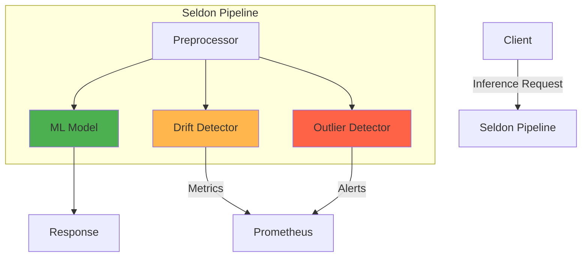

# Data Monitoring

While system monitoring tracks infrastructure health, ML-specific monitoring focuses on model behavior, data quality, and prediction reliability. This includes drift detection, outlier identification, and performance degradation tracking.

## Why ML Monitoring Matters

Machine learning models face unique challenges in production:

<CardGroup cols={2}>
  <Card title="Distribution Shift" icon="chart-line-up">
    Input data distributions change over time, causing models to perform poorly on new data
  </Card>
  <Card title="Concept Drift" icon="arrows-rotate">
    The relationship between inputs and outputs changes, invalidating learned patterns
  </Card>
  <Card title="Data Quality" icon="circle-exclamation">
    Missing values, outliers, or schema changes can cause silent failures
  </Card>
  <Card title="Model Degradation" icon="arrow-trend-down">
    Performance slowly declines as the world changes, often going unnoticed
  </Card>
</CardGroup>

<Warning>
Unlike traditional software bugs, ML model failures are often gradual and subtle. Without proper monitoring, you won't know your model is failing until users complain.
</Warning>

## Types of Drift

### Covariate Shift (Data Drift)

The distribution of input features changes: **P(X)** changes, but **P(Y|X)** remains the same.

**Example**: A credit scoring model trained on pre-pandemic data sees different income distributions post-pandemic.

```python
# Training data
X_train ~ N(μ=50000, σ=15000)  # Income distribution

# Production data after economic shift
X_prod ~ N(μ=45000, σ=20000)   # Different distribution!
```

### Prior Probability Shift (Label Drift)

The distribution of the target variable changes: **P(Y)** changes, but **P(X|Y)** remains the same.

**Example**: Fraud detection during a holiday shopping season sees more fraud attempts.

### Concept Drift

The relationship between inputs and outputs changes: **P(Y|X)** changes.

**Example**: User preferences change, making an old recommendation model obsolete.

## Monitoring Tools

### Evidently

[Evidently](https://github.com/evidentlyai/evidently) is an open-source library for ML monitoring:

- Generate interactive HTML reports
- Calculate drift metrics
- Profile data quality
- Track model performance
- No infrastructure required (can run as a Python script)

### Seldon Core

[Seldon Core](https://github.com/SeldonIO/seldon-core) is a model serving platform with built-in analytics:

- Outlier detection using Alibi Detect
- Drift detection in production
- Explainability with Alibi Explain
- Integration with Kubernetes and MLServer

### Alibi Detect

[Alibi Detect](https://github.com/SeldonIO/alibi-detect) provides algorithms for:

- Drift detection (KS test, MMD, Chi-squared)
- Outlier detection (Isolation Forest, Mahalanobis distance)
- Online and offline detection modes

### WhyLogs

[WhyLogs](https://github.com/whylabs/whylogs) offers lightweight data logging:

- Efficient statistical profiling
- Minimal storage overhead
- Streaming-friendly

## Seldon Core Setup

Seldon Core v2 provides a complete platform for model serving with monitoring capabilities.

### Architecture



### Prerequisites

Seldon Core v2 requires:

- Ansible and Python packages
- Kubernetes cluster (kind recommended)
- CLI tools (`kubectl`, `seldon`)

### Installation

<Steps>
  <Step title="Install Ansible and Dependencies">
    ```bash
    pip install ansible openshift docker passlib
    ansible-galaxy collection install \
      git+https://github.com/SeldonIO/ansible-k8s-collection.git
    ```
  </Step>
  
  <Step title="Clone Seldon Core Repository">
    ```bash
    git clone https://github.com/SeldonIO/seldon-core --branch=v2
    cd seldon-core
    ```
  </Step>
  
  <Step title="Run Ansible Playbooks">
    ```bash
    # Create kind cluster
    ansible-playbook playbooks/kind-cluster.yaml
    
    # Setup ecosystem (cert-manager, etc.)
    ansible-playbook playbooks/setup-ecosystem.yaml
    
    # Install Seldon Core
    ansible-playbook playbooks/setup-seldon.yaml
    ```
  </Step>
  
  <Step title="Install Seldon CLI">
    ```bash
    # Download CLI
    wget https://github.com/SeldonIO/seldon-core/releases/download/v2.7.0-rc1/seldon-linux-amd64
    
    # Make executable and move to PATH
    chmod +x seldon-linux-amd64
    sudo mv seldon-linux-amd64 /usr/local/bin/seldon
    
    # Verify installation
    seldon --help
    ```
  </Step>
  
  <Step title="Port Forward Services">
    ```bash
    # Inference endpoint
    kubectl port-forward --address 0.0.0.0 \
      svc/seldon-mesh -n seldon-mesh 9000:80
    
    # Scheduler (for loading models)
    kubectl port-forward --address 0.0.0.0 \
      svc/seldon-scheduler -n seldon-mesh 9004:9004
    ```
  </Step>
</Steps>

<Info>
The Ansible playbooks handle all the complexity of setting up Seldon Core, including namespaces, RBAC, and dependencies.
</Info>

### Basic Example: Iris Classification

Test the installation with a simple model:

```bash
# Load the model
seldon model load -f seldon-examples/model-iris.yaml \
  --scheduler-host 0.0.0.0:9004

# Wait for model to be ready
seldon model list

# Run inference
seldon model infer iris \
  '{"inputs": [{"name": "predict", "shape": [1, 4], "datatype": "FP32", "data": [[1, 2, 3, 4]]}]}' \
  --inference-host 0.0.0.0:9000
```

The model YAML:

```yaml
# model-iris.yaml
apiVersion: mlops.seldon.io/v1alpha1
kind: Model
metadata:
  name: iris
spec:
  storageUri: "gs://seldon-models/scv2/samples/mlserver_1.3.5/iris-sklearn"
  requirements:
  - sklearn
  memory: 100Ki
```

## Drift Detection Example

Seldon's income classification example demonstrates drift and outlier detection.

### Load Models and Detectors

```bash
# Load preprocessing model
seldon model load -f seldon-examples/pipeline/income-preprocess.yaml \
  --scheduler-host 0.0.0.0:9004

# Load classification model
seldon model load -f seldon-examples/pipeline/income.yaml \
  --scheduler-host 0.0.0.0:9004

# Load drift detector
seldon model load -f seldon-examples/pipeline/income-drift.yaml \
  --scheduler-host 0.0.0.0:9004

# Load outlier detector
seldon model load -f seldon-examples/pipeline/income-outlier.yaml \
  --scheduler-host 0.0.0.0:9004
```

### Drift Detector Configuration

```yaml
# income-drift.yaml
apiVersion: mlops.seldon.io/v1alpha1
kind: Model
metadata:
  name: income-drift
spec:
  storageUri: "gs://seldon-models/scv2/examples/mlserver_1.3.5/income/drift-detector"
  requirements:
    - mlserver
    - alibi-detect
```

The drift detector:
- Uses Kolmogorov-Smirnov (KS) test for continuous features
- Chi-squared test for categorical features
- Compares production data to reference distribution
- Returns drift scores and p-values

### Outlier Detector Configuration

```yaml
# income-outlier.yaml
apiVersion: mlops.seldon.io/v1alpha1
kind: Model
metadata:
  name: income-outlier
spec:
  storageUri: "gs://seldon-models/scv2/examples/mlserver_1.3.5/income/outlier-detector"
  requirements:
    - mlserver
    - alibi-detect
```

### Create Pipeline

Combine models into a pipeline:

```yaml
# income-pipeline.yaml
apiVersion: mlops.seldon.io/v1alpha1
kind: Pipeline
metadata:
  name: income-production
spec:
  steps:
    - name: income
    - name: income-preprocess
    - name: income-outlier
      inputs:
      - income-preprocess
    - name: income-drift
      batch:
        size: 20  # Check drift every 20 requests
  output:
    steps:
    - income
    - income-outlier.outputs.is_outlier
```

Load the pipeline:

```bash
seldon pipeline load -f seldon-examples/pipeline/income-pipeline.yaml \
  --scheduler-host 0.0.0.0:9004

# Verify
seldon pipeline list
```

### Send Test Data

Use the test client to send normal and anomalous data:

```python
# seldon-examples/pipeline/client.py
import numpy as np
import json
import requests

# Load test data
with open("./test.npy", "rb") as f:
    x_ref = np.load(f)      # Reference data
    x_h1 = np.load(f)       # Drifted data
    y_ref = np.load(f)      # Labels
    x_outlier = np.load(f)  # Outliers

def infer(resourceName: str, batchSz: int, requestType: str):
    """Send inference request."""
    # Select data based on type
    if requestType == "outlier":
        rows = x_outlier[0:batchSz]
    elif requestType == "drift":
        rows = x_h1[0:batchSz]
    else:
        rows = x_ref[0:batchSz]
    
    # Build request
    reqJson = {
        "inputs": [{
            "name": "input_1",
            "data": rows.flatten().tolist(),
            "datatype": "FP32",
            "shape": [batchSz, rows.shape[1]]
        }]
    }
    
    headers = {
        "Content-Type": "application/json",
        "seldon-model": resourceName
    }
    
    response = requests.post(
        "http://0.0.0.0:9000/v2/models/model/infer",
        json=reqJson,
        headers=headers
    )
    
    print(response.json())

# Test normal data
infer("income-production", 10, "normal")

# Test drift
infer("income-production", 10, "drift")

# Test outliers
infer("income-production", 10, "outlier")
```

The response includes:
- Model predictions
- Outlier detection results (`is_outlier` scores)
- Drift detection metrics (after batch size is reached)

## Evidently for Drift Detection

Evidently provides an easy way to generate drift reports:

```python
from evidently.report import Report
from evidently.metric_preset import DataDriftPreset, DataQualityPreset
import pandas as pd

# Load reference and current data
reference_data = pd.read_csv("reference.csv")
current_data = pd.read_csv("production.csv")

# Create report
report = Report(metrics=[
    DataDriftPreset(),
    DataQualityPreset()
])

# Run report
report.run(
    reference_data=reference_data,
    current_data=current_data
)

# Save as HTML
report.save_html("drift_report.html")
```

The report includes:
- Feature-by-feature drift scores
- Statistical tests (KS, Chi-squared, etc.)
- Distribution visualizations
- Data quality metrics (missing values, duplicates, etc.)

### Drift Detection in Pipelines

Integrate Evidently into your ML pipeline:

```python
import pandas as pd
from evidently.test_suite import TestSuite
from evidently.tests import TestColumnDrift

def check_drift(reference_df: pd.DataFrame, production_df: pd.DataFrame) -> bool:
    """Check if drift is detected."""
    tests = TestSuite(tests=[
        TestColumnDrift(column_name="age"),
        TestColumnDrift(column_name="income"),
        TestColumnDrift(column_name="education"),
    ])
    
    tests.run(reference_data=reference_df, current_data=production_df)
    
    # Return True if any test failed
    return not tests.as_dict()["summary"]["all_passed"]

# Use in your pipeline
if check_drift(reference_data, new_data):
    print("Drift detected! Triggering retraining...")
    trigger_retraining_pipeline()
```

## Monitoring Strategy

Design a comprehensive monitoring plan:

### 1. Define Metrics

<AccordionGroup>
  <Accordion title="Input Monitoring">
    - Feature distributions
    - Missing value rates
    - Outlier frequency
    - Data schema compliance
  </Accordion>
  
  <Accordion title="Output Monitoring">
    - Prediction distributions
    - Confidence scores
    - Class balance (for classification)
    - Output range (for regression)
  </Accordion>
  
  <Accordion title="Performance Monitoring">
    - Accuracy, precision, recall (when ground truth available)
    - Prediction-outcome correlation
    - Business metrics (conversion rate, revenue, etc.)
  </Accordion>
  
  <Accordion title="System Monitoring">
    - Latency (p50, p95, p99)
    - Throughput (requests per second)
    - Error rates
    - Resource usage
  </Accordion>
</AccordionGroup>

### 2. Ground Truth Collection

Ground truth is essential for measuring actual performance:

- **Delayed feedback**: Collect outcomes days or weeks later
- **User feedback**: Thumbs up/down, corrections
- **A/B testing**: Compare model variants
- **Manual labeling**: Sample and label production data
- **Proxy metrics**: Use correlated signals when direct labels unavailable

### 3. Alerting Thresholds

Define thresholds for alerts:

```yaml
alerts:
  - name: HighDriftScore
    condition: drift_score > 0.1
    severity: warning
    
  - name: PerformanceDegradation
    condition: accuracy < 0.85
    severity: critical
    
  - name: HighOutlierRate
    condition: outlier_rate > 0.05
    severity: warning
    
  - name: HighLatency
    condition: p95_latency > 2000ms
    severity: critical
```

### 4. Remediation Actions

<Steps>
  <Step title="Alert fires">
    Monitoring system detects drift or performance degradation
  </Step>
  <Step title="Investigate">
    Review dashboards, logs, and recent changes
  </Step>
  <Step title="Diagnose">
    Identify root cause (data quality issue, drift, bug, etc.)
  </Step>
  <Step title="Remediate">
    - Retrain model on recent data
    - Roll back to previous version
    - Apply hotfix or feature engineering
    - Adjust thresholds or business logic
  </Step>
  <Step title="Validate">
    Verify fix resolves the issue
  </Step>
  <Step title="Document">
    Record incident and learnings for future reference
  </Step>
</Steps>

## Best Practices

<CardGroup cols={2}>
  <Card title="Monitor Continuously" icon="clock">
    Don't wait for complaints. Set up automated monitoring to catch issues early.
  </Card>
  
  <Card title="Start Simple" icon="seedling">
    Begin with basic metrics (input distributions, latency, errors) before adding complex drift detection.
  </Card>
  
  <Card title="Use Multiple Methods" icon="layer-group">
    Combine statistical tests, business metrics, and manual review for comprehensive monitoring.
  </Card>
  
  <Card title="Close the Loop" icon="rotate">
    Feed production data back into training to keep models up-to-date.
  </Card>
</CardGroup>

## Additional Resources

- [Evidently Documentation](https://docs.evidentlyai.com/)
- [Seldon Core v2 Docs](https://docs.seldon.io/projects/seldon-core/en/v2/)
- [Alibi Detect Examples](https://docs.seldon.io/projects/alibi-detect/en/latest/)
- [Data Distribution Shifts and Monitoring (Chip Huyen)](https://huyenchip.com/2022/02/07/data-distribution-shifts-and-monitoring.html)
- [ML Observability Course (Evidently)](https://github.com/evidentlyai/ml_observability_course)
- [Monitoring Machine Learning Systems (Goku Mohandas)](https://github.com/GokuMohandas/monitoring-ml)

## Next Steps

<Card title="Practice Tasks" icon="arrow-right" href="/modules/module-7/practice">
  Complete the homework assignments to apply these monitoring concepts
</Card>
