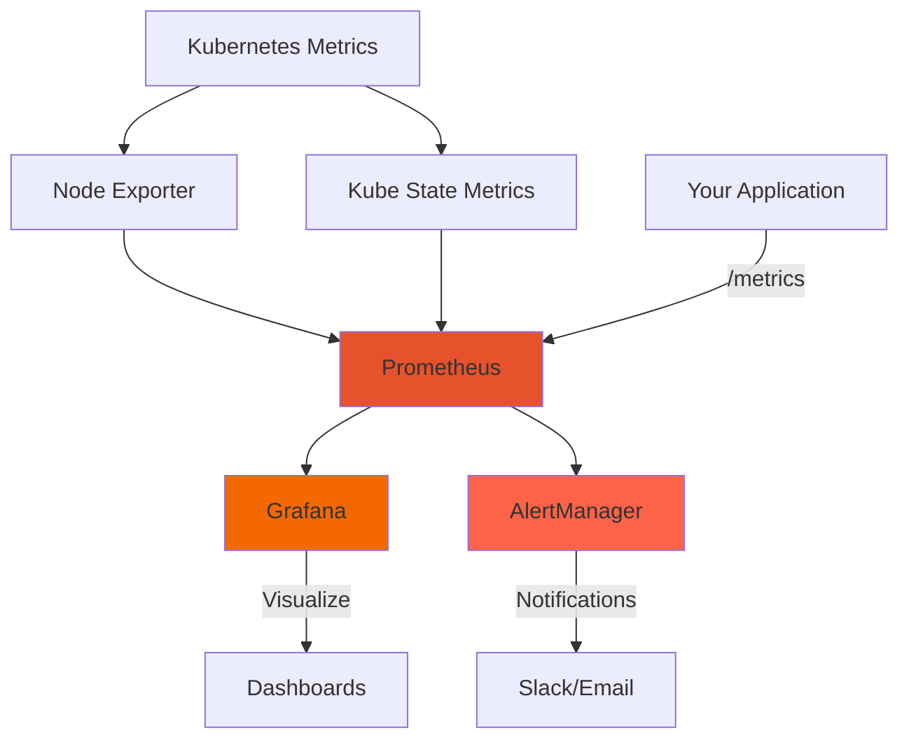

# Grafana

[Grafana](https://grafana.com/) is the leading open-source platform for metrics visualization and monitoring. Combined with Prometheus, it provides powerful monitoring for Kubernetes clusters and ML applications.

## Why Grafana and Prometheus?

This stack is the de facto standard for Kubernetes monitoring:

- **Prometheus**: Time-series database for metrics collection
- **Grafana**: Visualization layer with rich dashboards and alerting
- **kube-prometheus-stack**: Batteries-included Helm chart with:
  - Prometheus Operator
  - Node exporters
  - Pre-built Kubernetes dashboards
  - AlertManager for notifications

<Info>
While SigNoz focuses on traces and application observability, Grafana excels at system metrics, resource monitoring, and long-term trend analysis.
</Info>

## Architecture



- **Node Exporter**: Collects hardware and OS metrics from nodes
- **Kube State Metrics**: Exposes Kubernetes object state as metrics
- **Prometheus**: Scrapes and stores metrics
- **Grafana**: Queries Prometheus and renders dashboards
- **AlertManager**: Handles alerts and notifications

## Prerequisites

- Kubernetes cluster (kind, minikube, or cloud-based)
- `kubectl` configured
- `helm` 3.x installed
- At least 2GB RAM available for monitoring components

## Installation

### Step 1: Add Prometheus Community Helm Repository

```bash
# Add the repository
helm repo add prometheus-community https://prometheus-community.github.io/helm-charts

# Update repositories
helm repo update

# Verify
helm repo list
```

### Step 2: Install kube-prometheus-stack

```bash
# Install with default configuration
helm install monitoring prometheus-community/kube-prometheus-stack
```

This installs:
- Prometheus Operator
- Prometheus server
- Grafana
- AlertManager
- Node exporters
- Kube state metrics
- Pre-configured dashboards and alerts

<Tip>
The installation takes 2-3 minutes. Prometheus will start scraping metrics immediately.
</Tip>

### Step 3: Verify Installation

```bash
# Check all pods are running
kubectl get pods | grep monitoring

# You should see:
# - monitoring-kube-prometheus-operator
# - monitoring-prometheus-node-exporter
# - monitoring-kube-state-metrics
# - monitoring-grafana
# - alertmanager-monitoring-kube-prometheus-alertmanager
# - prometheus-monitoring-kube-prometheus-prometheus
```

## Accessing Grafana

### Get Admin Credentials

The default credentials are:
- **Username**: `admin`
- **Password**: `prom-operator`

<Warning>
Change the default password in production environments!
</Warning>

### Port Forward Grafana

```bash
# Forward Grafana to local port 3000
kubectl port-forward svc/monitoring-grafana 3000:80

# Access at http://localhost:3000
```

For remote access:

```bash
# Bind to all interfaces (use with caution)
kubectl port-forward --address 0.0.0.0 svc/monitoring-grafana 3000:80
```

### First Login

1. Navigate to `http://localhost:3000`
2. Log in with `admin` / `prom-operator`
3. (Optional) Change password in profile settings

## Pre-built Dashboards

The kube-prometheus-stack includes excellent dashboards out of the box:

### Kubernetes Cluster Monitoring

Navigate to **Dashboards** → **Browse** to find:

<AccordionGroup>
  <Accordion title="Kubernetes / Compute Resources / Cluster">
    Overview of cluster-wide resource usage:
    - CPU usage and requests
    - Memory usage and requests
    - Network I/O
    - Pod count
    
    Use this to monitor overall cluster health and capacity.
  </Accordion>
  
  <Accordion title="Kubernetes / Compute Resources / Namespace">
    Resource usage broken down by namespace:
    - CPU and memory per namespace
    - Pod counts
    - Network traffic
    
    Essential for understanding which applications consume the most resources.
  </Accordion>
  
  <Accordion title="Kubernetes / Compute Resources / Pod">
    Individual pod metrics:
    - CPU usage per container
    - Memory usage per container
    - Restart counts
    - Network usage
    
    Drill down to specific pods to debug performance issues.
  </Accordion>
  
  <Accordion title="Node Exporter / Nodes">
    Hardware-level metrics for each node:
    - CPU usage (system, user, idle)
    - Memory usage (used, cached, buffered)
    - Disk I/O and usage
    - Network traffic
    - System load average
    
    Critical for identifying node-level bottlenecks.
  </Accordion>
</AccordionGroup>

## Creating Custom Dashboards

### Exposing Metrics from Your Application

First, expose metrics from your Python application:

```python
from prometheus_client import Counter, Histogram, start_http_server
import time

# Define metrics
request_count = Counter(
    'ml_inference_requests_total',
    'Total ML inference requests',
    ['model', 'status']
)

inference_duration = Histogram(
    'ml_inference_duration_seconds',
    'Time spent on inference',
    ['model']
)

# Start metrics server on port 8000
start_http_server(8000)

def predict(model_name: str, data):
    """Run prediction and track metrics."""
    with inference_duration.labels(model=model_name).time():
        try:
            result = model.predict(data)
            request_count.labels(model=model_name, status='success').inc()
            return result
        except Exception as e:
            request_count.labels(model=model_name, status='error').inc()
            raise
```

### Configure Prometheus to Scrape Your App

Create a ServiceMonitor to tell Prometheus about your app:

```yaml
# servicemonitor.yaml
apiVersion: monitoring.coreos.com/v1
kind: ServiceMonitor
metadata:
  name: ml-model-metrics
  labels:
    release: monitoring  # Must match Prometheus's serviceMonitorSelector
spec:
  selector:
    matchLabels:
      app: ml-model
  endpoints:
  - port: metrics
    interval: 30s
```

Apply it:

```bash
kubectl apply -f servicemonitor.yaml
```

<Info>
Prometheus will automatically discover and scrape any service matching the selector.
</Info>

### Build a Custom Dashboard

1. In Grafana, click **+** → **Dashboard**
2. Click **Add visualization**
3. Select **Prometheus** as the data source
4. Enter a PromQL query

#### Example Queries

<CodeGroup>

```promql Request Rate
# Requests per second by model
rate(ml_inference_requests_total[5m])
```

```promql Error Rate
# Percentage of failed requests
sum(rate(ml_inference_requests_total{status="error"}[5m])) /
sum(rate(ml_inference_requests_total[5m])) * 100
```

```promql Latency Percentiles
# p95 inference latency
histogram_quantile(0.95, 
  rate(ml_inference_duration_seconds_bucket[5m])
)
```

```promql Memory Usage
# Container memory usage
container_memory_usage_bytes{pod=~"ml-model.*"}
```

</CodeGroup>

### Dashboard Example: ML Model Monitoring

Create a dashboard with these panels:

1. **Request Rate**: Line graph of requests per second
2. **Error Rate**: Percentage of failed requests
3. **Latency**: p50, p95, p99 percentiles
4. **Model Distribution**: Pie chart of requests by model
5. **Resource Usage**: CPU and memory consumption
6. **Pod Health**: Current pod count and restart rate

<Tip>
Use variables (e.g., `$namespace`, `$model`) to make dashboards reusable across different environments.
</Tip>

## Prometheus Query Language (PromQL)

PromQL is the query language for Prometheus. Key concepts:

### Instant Vectors

```promql
# Current value of a metric
ml_inference_requests_total

# With label filtering
ml_inference_requests_total{model="bert", status="success"}
```

### Range Vectors

```promql
# Last 5 minutes of data
ml_inference_requests_total[5m]
```

### Aggregation

```promql
# Sum across all labels
sum(ml_inference_requests_total)

# Sum by model
sum by (model) (ml_inference_requests_total)

# Average by status
avg by (status) (ml_inference_duration_seconds)
```

### Rate Function

```promql
# Per-second average rate over 5 minutes
rate(ml_inference_requests_total[5m])
```

The `rate()` function is essential for calculating metrics from counters.

### Combining Queries

```promql
# Error rate as percentage
(
  sum(rate(ml_inference_requests_total{status="error"}[5m]))
  /
  sum(rate(ml_inference_requests_total[5m])
) * 100
```

## Alerting

### Define Alert Rules

Create a PrometheusRule resource:

```yaml
# alerts.yaml
apiVersion: monitoring.coreos.com/v1
kind: PrometheusRule
metadata:
  name: ml-model-alerts
  labels:
    release: monitoring
spec:
  groups:
  - name: ml-model
    interval: 30s
    rules:
    - alert: HighErrorRate
      expr: |
        (
          sum(rate(ml_inference_requests_total{status="error"}[5m]))
          /
          sum(rate(ml_inference_requests_total[5m]))
        ) > 0.05
      for: 5m
      labels:
        severity: critical
      annotations:
        summary: "High error rate detected"
        description: "Error rate is {{ $value | humanizePercentage }} for 5 minutes"
    
    - alert: HighLatency
      expr: |
        histogram_quantile(0.95,
          rate(ml_inference_duration_seconds_bucket[5m])
        ) > 2
      for: 10m
      labels:
        severity: warning
      annotations:
        summary: "High inference latency"
        description: "P95 latency is {{ $value }}s"
```

Apply the rule:

```bash
kubectl apply -f alerts.yaml
```

### Configure AlertManager

Edit AlertManager config to send notifications:

```yaml
# alertmanager-config.yaml
apiVersion: v1
kind: Secret
metadata:
  name: alertmanager-monitoring-kube-prometheus-alertmanager
type: Opaque
stringData:
  alertmanager.yaml: |
    global:
      resolve_timeout: 5m
    route:
      group_by: ['alertname', 'cluster']
      group_wait: 10s
      group_interval: 10s
      repeat_interval: 12h
      receiver: 'slack'
    receivers:
    - name: 'slack'
      slack_configs:
      - api_url: 'https://hooks.slack.com/services/YOUR/WEBHOOK/URL'
        channel: '#alerts'
        title: 'Alert: {{ .GroupLabels.alertname }}'
        text: '{{ range .Alerts }}{{ .Annotations.description }}{{ end }}'
```

Apply the config:

```bash
kubectl apply -f alertmanager-config.yaml
```

<Warning>
Restart AlertManager pods after changing the configuration:
```bash
kubectl rollout restart statefulset alertmanager-monitoring-kube-prometheus-alertmanager
```
</Warning>

## Advanced Features

### Service Level Objectives (SLOs)

Define SLOs using recording rules:

```yaml
groups:
- name: slo
  interval: 30s
  rules:
  - record: job:ml_inference:success_rate
    expr: |
      sum(rate(ml_inference_requests_total{status="success"}[5m]))
      /
      sum(rate(ml_inference_requests_total[5m]))
  
  - alert: SLOViolation
    expr: job:ml_inference:success_rate < 0.99
    for: 10m
    annotations:
      summary: "SLO violated: success rate below 99%"
```

### Grafana Annotations

Add annotations to mark deployments or incidents:

```bash
# Add annotation via API
curl -X POST http://localhost:3000/api/annotations \
  -H "Content-Type: application/json" \
  -u admin:prom-operator \
  -d '{
    "time": '$(date +%s)000',
    "text": "Deployed v2.0",
    "tags": ["deployment"]
  }'
```

Annotations appear as vertical lines on graphs, helping correlate changes with metrics.

## Troubleshooting

<AccordionGroup>
  <Accordion title="No data in dashboards">
    1. Check Prometheus is running:
       ```bash
       kubectl get pods -l app.kubernetes.io/name=prometheus
       ```
    
    2. Verify Prometheus is scraping targets:
       ```bash
       kubectl port-forward svc/monitoring-kube-prometheus-prometheus 9090:9090
       ```
       Visit http://localhost:9090/targets
    
    3. Check for errors in Prometheus logs:
       ```bash
       kubectl logs -l app.kubernetes.io/name=prometheus
       ```
  </Accordion>
  
  <Accordion title="Grafana can't connect to Prometheus">
    1. Check the data source configuration in Grafana:
       - Go to **Configuration** → **Data Sources**
       - Click **Prometheus**
       - Click **Test** button
    
    2. Verify the URL is correct (usually `http://monitoring-kube-prometheus-prometheus.default:9090`)
    
    3. Check network policies aren't blocking access
  </Accordion>
  
  <Accordion title="Custom metrics not appearing">
    1. Verify ServiceMonitor is created:
       ```bash
       kubectl get servicemonitor
       ```
    
    2. Check ServiceMonitor has correct labels:
       ```bash
       kubectl get servicemonitor -o yaml
       ```
       Must have `release: monitoring` label
    
    3. Check Prometheus discovered the target:
       Visit http://localhost:9090/targets and search for your service
  </Accordion>
</AccordionGroup>

## Cleanup

To uninstall the monitoring stack:

```bash
# Uninstall Helm release
helm uninstall monitoring

# Optional: Delete CRDs
kubectl delete crd prometheuses.monitoring.coreos.com
kubectl delete crd prometheusrules.monitoring.coreos.com
kubectl delete crd servicemonitors.monitoring.coreos.com
kubectl delete crd alertmanagers.monitoring.coreos.com
```

## Best Practices

<CardGroup cols={2}>
  <Card title="Label Cardinality" icon="tags">
    Avoid high-cardinality labels (e.g., user IDs) as they explode metric storage. Use labels for finite sets like model names or environments.
  </Card>
  
  <Card title="Scrape Intervals" icon="clock">
    Balance between freshness and overhead. 30s is a good default; use 10s only for critical metrics.
  </Card>
  
  <Card title="Metric Retention" icon="database">
    Default is 15 days. Increase for long-term trend analysis, but monitor storage usage.
  </Card>
  
  <Card title="Alert Fatigue" icon="bell-slash">
    Only alert on actionable issues. Use severity levels (critical, warning, info) and smart routing.
  </Card>
</CardGroup>

## Additional Resources

- [Prometheus Documentation](https://prometheus.io/docs/)
- [Grafana Documentation](https://grafana.com/docs/)
- [kube-prometheus-stack Chart](https://github.com/prometheus-community/helm-charts/tree/main/charts/kube-prometheus-stack)
- [PromQL Cheat Sheet](https://promlabs.com/promql-cheat-sheet/)

## Next Steps

<Card title="Data Monitoring" icon="arrow-right" href="/modules/module-7/data-monitoring">
  Learn about ML-specific monitoring with Evidently and Seldon for drift detection
</Card>
