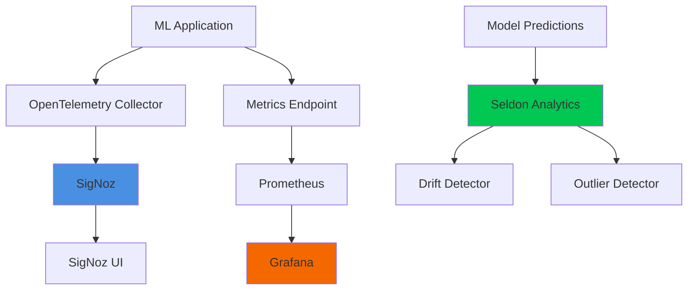

# Module 7: Monitoring

This module covers observability and monitoring strategies for machine learning applications in production. You'll learn how to instrument your applications with modern observability tools, set up dashboards for system metrics, and detect data drift in your ML models.

## What You'll Learn

In this module, you'll gain hands-on experience with:

<CardGroup cols={2}>
  <Card title="LLM Observability" icon="eye" href="/modules/module-7/observability">
    Instrument LLM applications with OpenTelemetry, LangSmith, and OpenLLMetry
  </Card>
  <Card title="SigNoz Setup" icon="chart-mixed" href="/modules/module-7/signoz">
    Deploy and configure SigNoz for distributed tracing and metrics
  </Card>
  <Card title="Grafana Dashboards" icon="chart-line" href="/modules/module-7/grafana">
    Set up Prometheus and Grafana for Kubernetes monitoring
  </Card>
  <Card title="Data Monitoring" icon="database" href="/modules/module-7/data-monitoring">
    Detect drift and outliers with Evidently and Seldon
  </Card>
</CardGroup>

## Module Overview

Monitoring is critical for maintaining reliable ML systems in production. This module focuses on three key areas:

### System Observability

Learn to instrument your applications with OpenTelemetry for distributed tracing, metrics, and logs. You'll set up:

- **SigNoz** for end-to-end observability
- **Grafana** dashboards for Kubernetes metrics
- **Prometheus** for metrics collection and alerting

### LLM Application Monitoring

Special attention to observability patterns for Large Language Model applications:

- Track token usage and costs
- Monitor latency and throughput
- Trace multi-step reasoning chains
- Compare different observability platforms (AgentOps, LangSmith, OpenLLMetry)

### Data Monitoring

Implement monitoring for your ML models and data pipelines:

- **Drift detection** to identify when input distributions change
- **Outlier detection** to catch anomalous requests
- **Model performance monitoring** to track prediction quality
- Integration with **Evidently** and **Seldon** for production monitoring

## Prerequisites

Before starting this module, you should have:

- A Kubernetes cluster (kind or similar)
- Basic understanding of Kubernetes concepts
- Familiarity with Python and ML concepts
- Experience with Module 5 (Model Serving) recommended

## Architecture

The monitoring stack includes:

## Learning Outcomes

By the end of this module, you will be able to:

<AccordionGroup>
  <Accordion title="Instrument applications for observability">
    - Add OpenTelemetry instrumentation to Python applications
    - Configure tracing for LLM applications
    - Send traces and metrics to observability backends
    - Use decorators and context managers for custom instrumentation
  </Accordion>
  
  <Accordion title="Deploy and configure monitoring tools">
    - Install SigNoz on Kubernetes using Helm
    - Set up Prometheus and Grafana stack
    - Configure service discovery and scraping
    - Create custom dashboards and alerts
  </Accordion>
  
  <Accordion title="Monitor ML models in production">
    - Deploy Seldon Core with drift and outlier detectors
    - Configure Evidently for data quality monitoring
    - Set up alerting for model degradation
    - Build monitoring pipelines for continuous validation
  </Accordion>
  
  <Accordion title="Design monitoring strategies">
    - Identify key metrics for ML systems
    - Plan ground truth collection strategies
    - Design alerting thresholds and SLOs
    - Document monitoring and incident response procedures
  </Accordion>
</AccordionGroup>

## Practice Tasks

This module includes hands-on homework assignments:

<Steps>
  <Step title="Integrate SigNoz Monitoring">
    Add SigNoz instrumentation to your application and verify traces are being collected.
  </Step>
  <Step title="Create Grafana Dashboard">
    Build a custom dashboard showing key metrics for your application.
  </Step>
  <Step title="Implement Drift Detection">
    Add drift detection logic to your ML pipeline (Kubeflow, Airflow, or Dagster).
  </Step>
  <Step title="Design Monitoring Strategy">
    Document your system and ML monitoring plan, including ground truth collection and alert definitions.
  </Step>
</Steps>

See the [Practice](/modules/module-7/practice) page for detailed requirements and evaluation criteria.

## Tools and Technologies

This module uses the following tools:

- **SigNoz**: Open-source observability platform
- **Grafana**: Visualization and dashboarding
- **Prometheus**: Metrics collection and alerting
- **OpenTelemetry**: Instrumentation framework
- **LangSmith**: LLM application monitoring
- **AgentOps**: Agent workflow observability
- **OpenLLMetry**: LLM-specific telemetry
- **Evidently**: ML monitoring and drift detection
- **Seldon Core**: Model serving with analytics
- **Alibi Detect**: Outlier and drift detection algorithms

## Reading Materials

Key papers and resources:

- [How ML Breaks: A Decade of Outages for One Large ML Pipeline](https://www.usenix.org/conference/opml20/presentation/papasian)
- [Monitoring and explainability of models in production](https://arxiv.org/abs/2007.06299)
- [Data Distribution Shifts and Monitoring](https://huyenchip.com/2022/02/07/data-distribution-shifts-and-monitoring.html)
- [Failing Loudly: An Empirical Study of Methods for Detecting Dataset Shift](https://arxiv.org/abs/1810.11953)

## Next Steps

<CardGroup cols={2}>
  <Card title="Start with Observability" icon="arrow-right" href="/modules/module-7/observability">
    Learn LLM observability concepts and patterns
  </Card>
  <Card title="View Practice Tasks" icon="list-check" href="/modules/module-7/practice">
    See homework assignments and criteria
  </Card>
</CardGroup>
