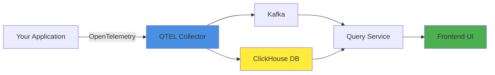

# SigNoz

[SigNoz](https://signoz.io/) is an open-source observability platform that provides distributed tracing, metrics, and logs in a unified interface. It's a self-hosted alternative to DataDog or New Relic, built on OpenTelemetry standards.

## Why SigNoz?

SigNoz offers several advantages for ML applications:

- **Open-source**: No vendor lock-in, full control over your data
- **OpenTelemetry native**: Works with standard instrumentation
- **Unified platform**: Traces, metrics, and logs in one place
- **Cost-effective**: Self-hosted means no per-seat or per-event pricing
- **Query flexibility**: Use ClickHouse for powerful analytics

<Info>
SigNoz is built on ClickHouse, which provides excellent performance for storing and querying large volumes of trace data.
</Info>

## Architecture

SigNoz consists of several components:



- **OTEL Collector**: Receives, processes, and exports telemetry data
- **ClickHouse**: Columnar database for storing traces and metrics
- **Query Service**: API for querying data from ClickHouse
- **Frontend**: React-based UI for visualization

## Prerequisites

Before installing SigNoz, ensure you have:

- A Kubernetes cluster (kind, minikube, or cloud-based)
- `kubectl` configured to access your cluster
- `helm` 3.x installed
- At least 4GB of RAM available for SigNoz components

<Tip>
If you're using kind, create a cluster with:
```bash
kind create cluster --name ml-in-production
```
</Tip>

## Installation

### Step 1: Enable Volume Expansion

SigNoz requires persistent storage with volume expansion enabled:

```bash
# Get the default storage class
DEFAULT_STORAGE_CLASS=$(kubectl get storageclass \
  -o=jsonpath='{.items[?(@.metadata.annotations.storageclass\.kubernetes\.io/is-default-class=="true")].metadata.name}')

# Enable volume expansion
kubectl patch storageclass "$DEFAULT_STORAGE_CLASS" \
  -p '{"allowVolumeExpansion": true}'
```

This allows SigNoz to automatically expand its storage volumes as needed.

### Step 2: Add SigNoz Helm Repository

```bash
# Add the SigNoz Helm repository
helm repo add signoz https://charts.signoz.io

# Update your Helm repositories
helm repo update

# Verify the repository was added
helm repo list
```

### Step 3: Install SigNoz

```bash
# Install SigNoz in the default namespace
helm install my-release signoz/signoz
```

This installs SigNoz with default configuration. The installation takes a few minutes as it:

1. Creates PersistentVolumeClaims for ClickHouse and Kafka
2. Deploys all components (collector, query service, frontend, etc.)
3. Waits for all pods to be ready

<Warning>
The default installation uses significant resources. For production, customize the values.yaml to adjust resource requests and limits.
</Warning>

### Step 4: Verify Installation

Check that all pods are running:

```bash
kubectl get pods | grep my-release
```

You should see pods for:
- `my-release-signoz-clickhouse`
- `my-release-signoz-otel-collector`
- `my-release-signoz-query-service`
- `my-release-signoz-frontend`
- `my-release-signoz-kafka`
- `my-release-signoz-zookeeper`

## Accessing SigNoz

### Port Forwarding

For local access, use kubectl port-forward:

<CodeGroup>

```bash Frontend UI
# Forward the frontend on port 3301
kubectl port-forward svc/my-release-signoz-frontend 3301:3301

# Access at http://localhost:3301
```

```bash OTEL Collector
# Forward the collector on port 4318 (HTTP)
kubectl port-forward svc/my-release-signoz-otel-collector 4318:4318

# This is where your applications send traces
```

</CodeGroup>

<Tip>
You can run both port-forwards simultaneously in separate terminal windows.
</Tip>

### Remote Access

For remote access (e.g., from a development machine to a remote cluster):

```bash
# Bind to all interfaces (use with caution)
kubectl port-forward --address 0.0.0.0 \
  svc/my-release-signoz-frontend 3301:3301

kubectl port-forward --address 0.0.0.0 \
  svc/my-release-signoz-otel-collector 4318:4318
```

<Warning>
Binding to 0.0.0.0 exposes the service to your network. Only use this in secure, trusted environments.
</Warning>

## Configuring Applications

### Environment Variables

Configure your application to send traces to SigNoz:

```bash
# OpenTelemetry endpoint
export OTEL_EXPORTER_OTLP_ENDPOINT="http://localhost:4318"

# Or for OpenLLMetry/Traceloop
export TRACELOOP_BASE_URL="http://localhost:4318"

# Service name (helps identify your app in SigNoz)
export OTEL_SERVICE_NAME="my-ml-service"
```

### Python Configuration

For Python applications using OpenLLMetry:

```python
import os
from traceloop.sdk import Traceloop

# Set the endpoint
os.environ["TRACELOOP_BASE_URL"] = "http://localhost:4318"

# Initialize with your service name
Traceloop.init(app_name="text2sql")
```

## Using the SigNoz UI

### First Login

1. Navigate to `http://localhost:3301`
2. Create an account (stored locally in ClickHouse)
3. Complete the onboarding wizard

### Viewing Traces

The **Traces** page shows all incoming traces:

- **Timeline view**: See when requests occurred
- **List view**: Browse traces with filtering
- **Trace detail**: Click a trace to see the full span tree

<Info>
Traces are organized by service name, which comes from the `OTEL_SERVICE_NAME` environment variable.
</Info>

### Key Features

<AccordionGroup>
  <Accordion title="Filtering and Search">
    Use the query builder to filter traces by:
    - Service name
    - HTTP status code
    - Duration (e.g., slower than 1s)
    - Custom attributes (e.g., user ID, model name)
    - Tags and metadata
    
    Example query:
    ```
    service.name = 'text2sql' AND duration > 1000ms AND status = 'error'
    ```
  </Accordion>
  
  <Accordion title="Span Details">
    Click on any span to see:
    - Attributes (key-value pairs)
    - Events (timestamped logs within the span)
    - Parent-child relationships
    - Timing information
    
    For LLM applications, you'll see:
    - Model name
    - Token counts (prompt, completion, total)
    - Temperature and other parameters
    - Prompt and response content (if logged)
  </Accordion>
  
  <Accordion title="Service Map">
    The service map shows:
    - All services in your system
    - Dependencies between services
    - Request rates and error rates
    - Latency percentiles
    
    This helps identify bottlenecks and failure points in distributed systems.
  </Accordion>
  
  <Accordion title="Metrics Dashboard">
    SigNoz automatically generates metrics from traces:
    - Request rate (requests per second)
    - Error rate (percentage of failed requests)
    - Duration (p50, p90, p95, p99)
    
    You can also create custom dashboards with ClickHouse queries.
  </Accordion>
</AccordionGroup>

## Example: Monitoring LLM Applications

### Instrumenting Your App

```python
import os
from traceloop.sdk import Traceloop
from traceloop.sdk.decorators import workflow
from openai import OpenAI

# Configure endpoint
os.environ["TRACELOOP_BASE_URL"] = "http://localhost:4318"

# Initialize
Traceloop.init(app_name="text2sql")

client = OpenAI()

@workflow(name="generate_sql")
def generate_sql(query: str, schema: str) -> str:
    """Generate SQL from natural language."""
    response = client.chat.completions.create(
        model="gpt-4o-mini",
        messages=[
            {"role": "system", "content": f"Database schema: {schema}"},
            {"role": "user", "content": query}
        ]
    )
    return response.choices[0].message.content

# Use the function
result = generate_sql(
    query="Show all users who signed up last month",
    schema="users(id, email, created_at)"
)
```

### What You'll See in SigNoz

After running your application:

1. **Service**: `text2sql` appears in the services list
2. **Traces**: Each invocation creates a trace with spans for:
   - The `generate_sql` workflow
   - The OpenAI API call
   - Network requests
3. **Attributes**: Token counts, model name, latency
4. **Metrics**: Aggregate statistics over time

## Advanced Configuration

### Custom Values

Create a `values.yaml` file to customize the installation:

```yaml
# values.yaml
clickhouse:
  persistence:
    size: 20Gi
  resources:
    requests:
      memory: "2Gi"
      cpu: "1000m"
    limits:
      memory: "4Gi"
      cpu: "2000m"

otelCollector:
  resources:
    requests:
      memory: "512Mi"
      cpu: "500m"
    limits:
      memory: "1Gi"
      cpu: "1000m"

queryService:
  replicas: 2
```

Install with custom values:

```bash
helm install my-release signoz/signoz -f values.yaml
```

### Sampling Configuration

For high-volume applications, configure sampling:

```yaml
# values.yaml
otelCollector:
  config:
    processors:
      probabilistic_sampler:
        sampling_percentage: 10  # Sample 10% of traces
```

## Troubleshooting

<AccordionGroup>
  <Accordion title="Pods not starting">
    Check resource availability:
    ```bash
    kubectl describe pod <pod-name>
    ```
    
    Common issues:
    - Insufficient memory or CPU
    - PersistentVolume not provisioning
    - Image pull errors
  </Accordion>
  
  <Accordion title="No traces appearing">
    1. Verify port-forward is active:
       ```bash
       curl http://localhost:4318/health
       ```
    
    2. Check application configuration:
       - `TRACELOOP_BASE_URL` is set correctly
       - Application can reach the collector
    
    3. Check collector logs:
       ```bash
       kubectl logs -f deployment/my-release-signoz-otel-collector
       ```
  </Accordion>
  
  <Accordion title="ClickHouse errors">
    ClickHouse may run out of disk space. Check usage:
    ```bash
    kubectl exec -it statefulset/my-release-signoz-clickhouse -- df -h
    ```
    
    Resize the PVC if needed:
    ```bash
    kubectl patch pvc data-my-release-signoz-clickhouse-0 \
      -p '{"spec":{"resources":{"requests":{"storage":"50Gi"}}}}'
    ```
  </Accordion>
</AccordionGroup>

## Cleanup

To uninstall SigNoz:

```bash
helm uninstall my-release

# Optional: Delete PVCs to free disk space
kubectl delete pvc -l app.kubernetes.io/instance=my-release
```

## Best Practices

<CardGroup cols={2}>
  <Card title="Use Service Names" icon="tag">
    Set descriptive `OTEL_SERVICE_NAME` values to distinguish between services and environments.
  </Card>
  
  <Card title="Monitor Resource Usage" icon="gauge">
    ClickHouse and Kafka can consume significant resources. Monitor and adjust limits as needed.
  </Card>
  
  <Card title="Configure Retention" icon="clock">
    Set data retention policies to prevent unlimited growth. Default is 7 days.
  </Card>
  
  <Card title="Use Sampling in Production" icon="filter">
    Enable sampling for high-volume services to reduce storage costs and overhead.
  </Card>
</CardGroup>

## Additional Resources

- [SigNoz Documentation](https://signoz.io/docs/)
- [Python Instrumentation Guide](https://signoz.io/docs/instrumentation/python/)
- [Kubernetes Deployment Guide](https://signoz.io/docs/install/kubernetes/)
- [ClickHouse Configuration](https://clickhouse.com/docs/en/)

## Next Steps

<Card title="Set Up Grafana" icon="arrow-right" href="/modules/module-7/grafana">
  Configure Grafana and Prometheus for Kubernetes metrics monitoring
</Card>
